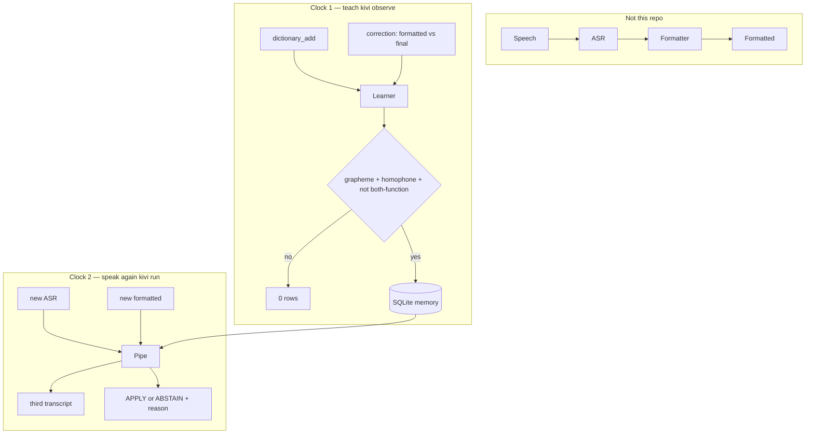
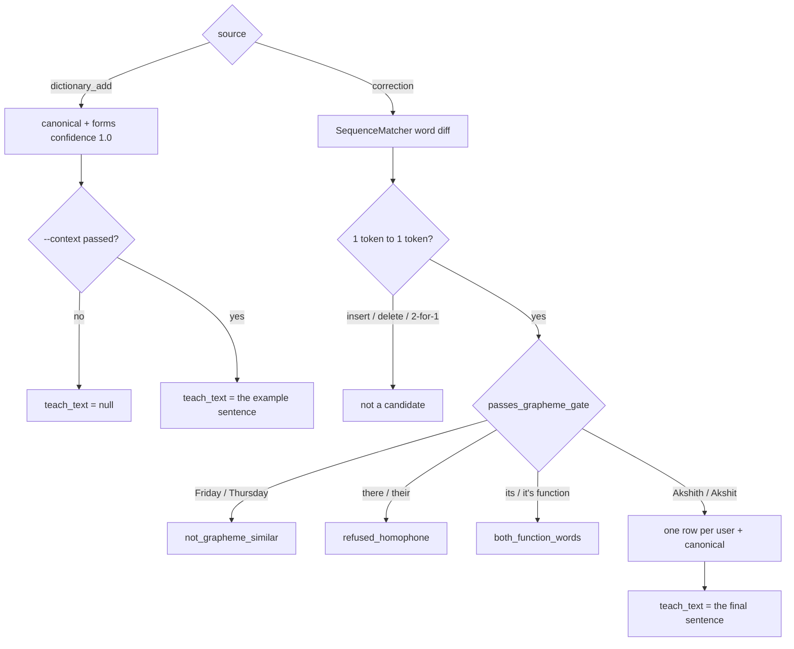
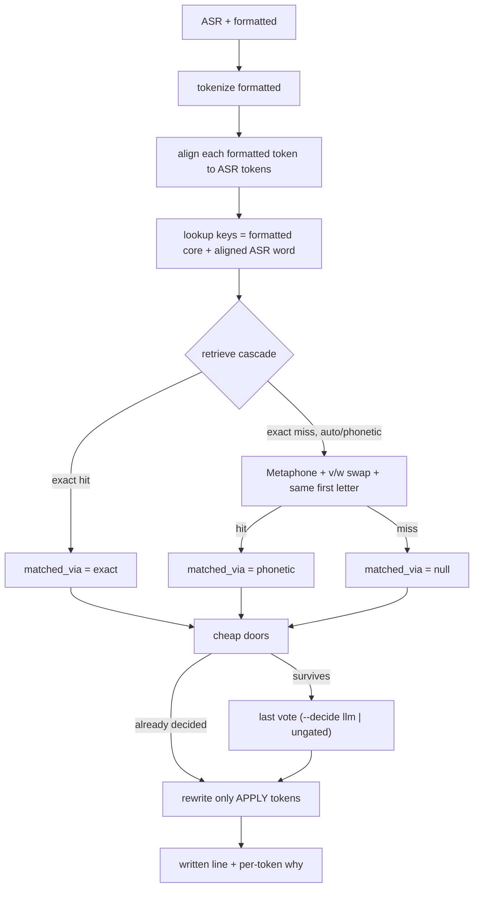
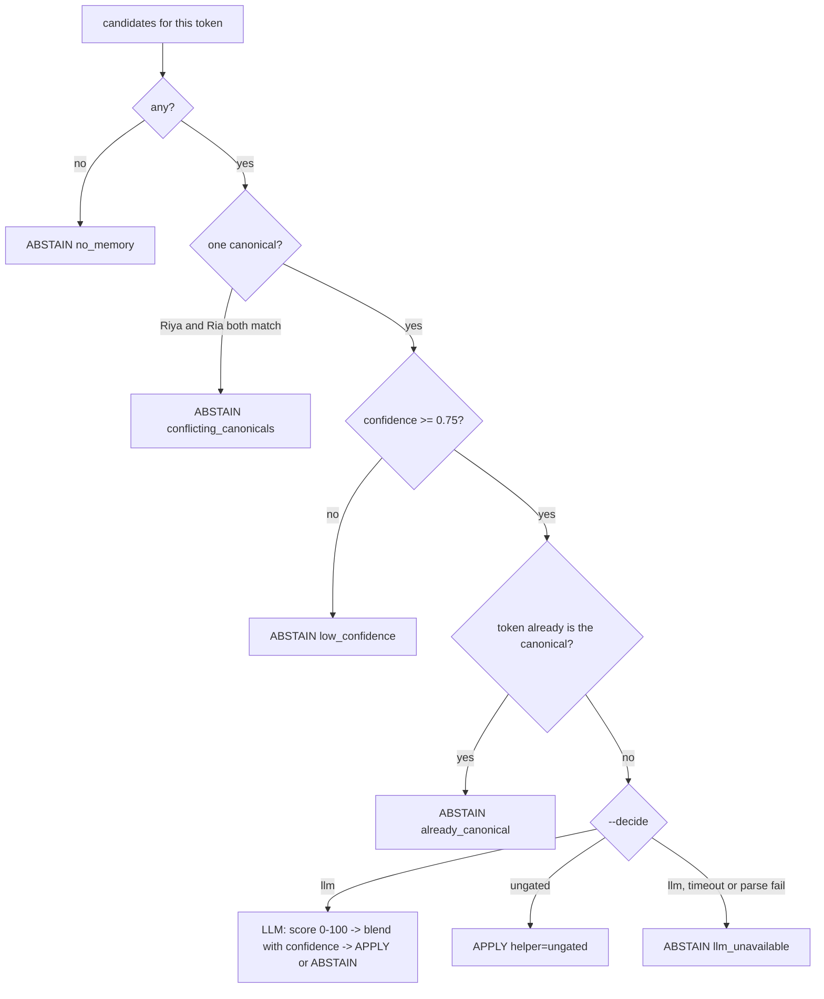
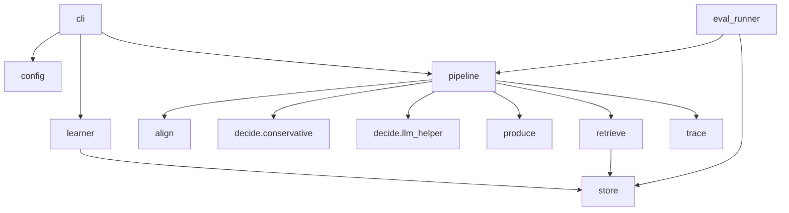
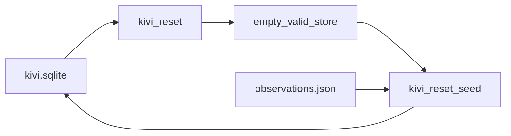

# Kivi Memory Lab

A **per-user word notebook**. Not speech-to-text, not a formatter, not
chat memory, not a knowledge graph, not RAG.

Kivi already turns speech into **ASR text**, then a language model into
**formatted text**. Those two are inputs. This lab produces the **third**
transcript: this user's spellings — or it **leaves the line alone**.

```
said      ask akshith to bump postgress and graffana
typed     Ask Akshith to bump postgress and graffana.
written   Ask Akshit to bump Postgres and Grafana.
```

Primary review: local CLI + SQLite. Exact commands: [RUN.md](RUN.md).

---

## What it can distinguish

Doing nothing is half the product. Every row below is a committed eval
row in `eval/dataset/cases.csv` with an asserted hit or no-op, not a claim —
run `uv run kivi --decide ungated eval` to reproduce the committed
snapshot (see [Evaluation](#evaluation) and [Metrics](#metrics)).

| Situation                                                                          | What it does                                     | Why                                                                                     |
| ----------------------------------------------------------------------------------- | ------------------------------------------------- | ---------------------------------------------------------------------------------------- |
| Taught spelling, matching use (`Akshith` → `Akshit`)                                | **APPLY**                                         | Exact retrieve finds the stored form, confidence ≥ 0.75, token ≠ canonical               |
| Formatter expanded the line (`im gonna ask akshith` → `I'm going to ask Akshith.`)  | **APPLY** on `Akshith` only                        | Alignment is a `SequenceMatcher` diff, never index `i`                                   |
| Unseen phonetic variant (`graffana` when only `Grafana` was stored)                 | `exact` **ABSTAIN**, `auto`/`phonetic` **APPLY**   | Retrieve cascade: exact first, phonetic on miss. Proves the two retrievers aren't redundant |
| Brand that is also a common word, wrong sense (`buy kiwi at the store`, key set)     | **ABSTAIN** `sense_mismatch`                       | The LLM sense helper is the last vote, not lexical overlap                               |
| Same brand, unrelated neighbor words but the right sense (`restart the Kiwi pod in staging`, key set) | **APPLY**                          | No shared vocabulary with the teach sentence at all — sense, not cue overlap              |
| `--decide ungated` (latency path, no model)                                         | **APPLY ungated** once a candidate survives the cheap doors | No sense check: see [LLM sense helper](#llm-sense-helper---last-vote-no-cue-fallback) |
| Already spelled right, or only case differs (`Meera`, `sarvam`)                     | **ABSTAIN** `already_canonical`                    | Case is not a correction signal; the formatter owns capitalization                        |
| Two real people, one surface (`Riya` and `Ria`)                                     | **ABSTAIN** `conflicting_canonicals`               | Never guess an identity by ranking confidence                                             |
| Content edit or grammar fix (`Friday`→`Thursday`, `there`→`their`)                  | **Learns nothing**, 0 rows                         | Grapheme gate + closed homophone refuse list, not a threshold                             |
| Multi-token compound (`blink it` → `Blinkit`)                                       | **ABSTAIN** `no_memory`                            | One token → one token is the whole abstraction                                            |
| Empty input                                                                          | **ABSTAIN**, no crash                              | Cold path is a no-op                                                                       |

---

## Architecture

We never record audio. We never own the formatter. This lab stands in
for "put the chosen words into formatting." No cue gate anywhere in the
live path.

**Not a dynamic pick between dictionary and LLM.** One pipeline, always:
the SQLite notebook retrieves (exact, then phonetic on miss); cheap doors
run; then a last vote. The model never finds names and never writes
SQLite. `--decide` is a flag, not a per-token router — `llm` (default)
requires `KIVI_LLM_API_KEY` and `KIVI_LLM_MODEL`; `ungated` skips the
HTTP call so you can measure retrieve latency. Missing credentials on
`--decide llm` error out; they do not fall through to ungated.

The product is two clocks and one store. ASR is never mined.



`kivi reset` wipes the store. `kivi reset --seed` replays
`data/seed/observations.json`.

### A memory is a word, not a sentence

Each row is one identity for one user.

| Field        | Meaning                                                          |
| ------------ | ----------------------------------------------------------------- |
| `canonical`  | how they write it (`Akshit`, `Postgres`)                          |
| `forms`      | how it has appeared (`akshith`, `postgress`)                      |
| `confidence` | 1.0 dictionary; 0.85 first correction; +0.05/correction, cap 1.0  |
| `teach_text` | the correction sentence, or an optional `dictionary_add` example — evidence for the LLM prompt, **never a gate** |

We do **not** store "Akshit is a colleague" or the whole utterance.
Admission test: if deleting the row cannot change a future transcript's
wording of a personal term, it is not this memory.

Same `user_id` + same `canonical` → merge forms, do not duplicate the row.
`teach_text` is replaced by the newer evidence on a later teach, not unioned
— it is a prompt hint, not an accumulating gate.

### Clock 1 — what gets into the notebook

`kivi observe`. User-asserted only.



### Clock 2 — a new line comes in

`kivi run`. `--profile off` returns formatted and stops.



### Retrieve cascade — exact then phonetic, one on-path

Per token, the lookup keys are the formatted core plus the
`SequenceMatcher`-aligned ASR token (never a positional index).

1. `exact.retrieve(surfaces)`. Any candidates → stop, `matched_via = "exact"`.
   Exact always wins when the surface is already a stored form.
2. Else `phonetic.retrieve(surfaces)`. Any candidates →
   `matched_via = "phonetic"`.
3. Else no candidates, `matched_via = null`.

`--profile auto` (**default**) runs this cascade. `--profile exact` and
`--profile phonetic` force a single retriever — an ablation flag, not a
different decide path: both still run the same cheap doors and last vote
below. `--profile off` skips retrieval entirely and returns formatted
unchanged.

`--decide llm` (**default**) is the product last vote and **requires**
`KIVI_LLM_API_KEY` plus `KIVI_LLM_MODEL`. `--decide ungated` is the latency
path: same retrieve and cheap doors, no HTTP.

### Decide — cheap doors, first no wins



No cue gate anywhere in this path. There is no closed word list standing in
for one either.

### LLM sense helper — last vote, no cue fallback

The model does not find names and does not write SQLite. Once exactly one
candidate memory survives the cheap doors, it answers one question about
**one marked occurrence** of the token: how confident are you, 0-100, that
this occurrence is the same personal/product spelling as the stored
canonical?

The score alone doesn't decide — it's blended with the memory's own
confidence (evidence this is a real taught spelling at all, independent of
sense):

```
combined = memory.confidence * (score / 100)
APPLY iff combined >= 0.5 (LLM_COMBINED_APPLY_THRESHOLD), else ABSTAIN
```

Weak evidence on either axis pulls the decision down — a shaky first
correction (confidence 0.85) needs a more confident score than a
`dictionary_add` (confidence 1.0) to cross the same threshold. `llm_score`
is recorded on every `TokenDecision` so the raw number is inspectable in
`run --json`, not just the final APPLY/ABSTAIN.

**One HTTP call per `kivi run`, not per word.** There is no paragraph
chunk size. Whatever string you pass is the unit. Survivors are numbered
together (`[[#1: grow]]`, `[[#2: meghna]]`, …) via
`pipeline.align.mark_occurrences` and scored in **one** blocking
`POST /chat/completions` (stdlib `urllib`, not SSE). Common words never
reach this stage unless they are in the notebook. A function-word list
exists only at **teach** time (`COMMON_FUNCTION_WORDS`), so grammar fixes
are not stored.

The same word can appear twice with two senses — *"move the stocks from
grow as the profits didn't grow last FY"*. Both marks go in that one
call; the model returns one 0–100 score per number. A malformed reply or
a count that does not match ABSTAINs `llm_unavailable` for the whole
batch. Prompted with only: the marked sentence, each occurrence's
canonical + forms, and `teach_text` if present. Temperature 0, 15s
timeout, reply capped at 1024 tokens.

**`--decide llm` requires a model.** `KIVI_LLM_API_KEY` and `KIVI_LLM_MODEL`
are compulsory (see `.env.example`). A timeout or unparseable response
ABSTAINs (`helper = "llm"`, `reason = "llm_unavailable"`) — it does not
silently rewrite. Missing credentials on this path are a CLI error, not
an ungated APPLY.

**`--decide ungated` is the latency path.** Same retrieve cascade and cheap
doors, no HTTP (`helper = "ungated"`, `reason = "ungated"`). Use it to
measure retrieve time (eval rows ~0.5 ms; stress paragraphs ~16 ms). It means:

- `Groww`/`grow` rewrites `"The plants will grow faster in the sun."` to
  `"...will Groww faster..."` — wrong, and expected on this path.
- `kiwi`/`Kivi` rewrites the grocery sentence too, not just the work one.

`kivi --decide ungated eval` SKIPS (does not fail) any row whose behavior
depends on a real sense check — see
[eval/dataset/README.md](eval/dataset/README.md).

Provider: any OpenAI-compatible chat completions host — default is
[Anthropic Claude Haiku](https://console.anthropic.com)
(`claude-haiku-4-5-20251001`), nothing provider-specific in the code. Paid,
not free, but measurably more accurate on sense-disambiguation than the
free models we measured (Groq's `openai/gpt-oss-20b`/`-120b`, OpenRouter's
free tier) — see RUN.md for the comparison and a free fallback if you don't
have an Anthropic key. One module (`decide/llm_helper.py`), stdlib
`urllib` only — no new HTTP dependency, and the eval CSV runner calls the
same module rather than duplicating the request.

---

## Profiles

| Profile    | Retriever                          | Decide                       | Status            |
| ---------- | ----------------------------------- | ----------------------------- | ------------------ |
| `off`      | —                                    | none, passthrough              | shipped            |
| `exact`    | string overlap only (ablation)      | cheap doors + `--decide`       | shipped            |
| `phonetic` | classic Metaphone + `v↔w` (ablation) | cheap doors + `--decide`       | shipped            |
| `auto`     | exact → phonetic cascade            | cheap doors + `--decide`       | shipped (**default**) |

Unknown `--profile` errors. It does not fall back.

---

## Assumptions

These are bets the diagrams above rest on. They are not hidden.

- **ASR and formatted text already exist.** This repo does not hear audio
  and does not format speech. The only output is the third transcript, or
  the formatted line unchanged.
- **The user asserts a spelling.** Writes come from `dictionary_add` or a
  1:1 `correction`. Unusual words in raw ASR are not harvested.
- **One token maps to one token.** Inserts, deletes, and compounds
  (`blink it` → `Blinkit`) are sentence edits, not memory.
- **Case belongs to the formatter.** `Meera` / `meera` is not a teach
  signal and not a rewrite.
- **Sense disambiguation is the LLM's job, not a token-overlap gate.**
  There is no cue bag, and no closed word list standing in for one.
  `--decide llm` requires a model; `--decide ungated` is explicit about
  skipping the sense check.
- **Conflict is not a ranking problem.** Two canonicals for one surface
  → ABSTAIN. We do not pick the higher confidence.
- **Letters are not identity.** `Lakshmi`/`Laxmi` and `Sanjay`/`Sanjeev`
  can look the same to every string rule we have, and `Karan`/`Karen` share
  a Metaphone code. Speaker identity is out of scope; the LLM helper checks
  *sense* in one sentence, not *who said it* — these collisions stay
  documented, not silently fixed.
- **Review is local.** SQLite on disk, no daemon. The LLM helper is the one
  network call on `--decide llm`. Key and model are compulsory on that path.

---

## Decisions

| Decision                                                          | Why                                                              |
| ------------------------------------------------------------------ | ------------------------------------------------------------------ |
| Memory is a lexical row, not a chat log                            | The brief is phonetic / word-level memory, not personal AI       |
| Learn only from Dictionary add or a 1:1 spelling correction        | Ordinary use; ASR alone must not write the notebook              |
| Retrieve is exact-then-phonetic, one cascade, no matrix of gates   | Exact is cheap and precise; phonetic recovers what exact misses  |
| No runtime "dictionary or LLM" router                              | Notebook always retrieves; the model is only the last APPLY/ABSTAIN vote. `--decide` is a flag, not per-token routing |
| Sense disambiguation is an LLM last vote, not a cue gate           | A cue gate needs lexical overlap with the teach sentence and cannot generalize; an LLM reasons about sense from one sentence alone |
| `--decide llm` requires key + model; timeout/parse → ABSTAIN `llm_unavailable` | The product path does not silently rewrite when the sense check cannot run |
| `--decide ungated` is the latency / ablation path                          | Same retrieve + cheap doors, no HTTP — eval rows ~0.5 ms, stress paragraphs ~16 ms |
| APPLY iff confidence ≥ 0.75, unique canonical, token ≠ canonical, then last vote | Weak or conflicting evidence → do nothing before ever asking the model |
| First correction is 0.85, not 0.60                                 | One teach must be enough                                          |
| `auto` is the default retrieve path                                | Cascade retrieve, inspectable, resettable; last vote is `--decide` |
| `off` is a profile, not a missing store                            | Lets eval tell "memory did nothing" from "memory is disabled"     |
| Alignment is `SequenceMatcher`, never index `i`                    | Formatters expand contractions and drop fillers                   |
| No Hugging Face, no vector DB, no entity graph, no embeddings      | Out of scope for this edge                                        |

---

## Limitations

- **Alignment** works when ASR and formatted tokens mostly correspond. It degrades on a heavy formatter paraphrase.
- **Grapheme gate** requires the same first letter and a similarity floor. `film` → `vLLM` cannot be learned from a correction; use `dictionary_add`.
- **Homophone refuse list** is closed (`there`/`their`, `your`/`you're`, …). New grammar pairs are not inferred.
- **One token → one token.** Compounds (`fast api` → `FastAPI`) are structural ABSTAIN, not a miss we pretend to fix.
- **`--decide ungated` means no sense check.** Any token that clears the cheap doors APPLYs — `Groww`/`grow` rewrites gardening sentences, `kiwi`/`Kivi` rewrites grocery lists. This is the latency path (see [LLM sense helper](#llm-sense-helper---last-vote-no-cue-fallback)), not a hidden default.
- **The LLM helper does not solve speaker identity.** `Sanjay → Sanjeev` passes the correction grapheme gate (same first letter, ratio 0.77) and gets learned as if it were a respelling; `--profile phonetic` also collides `Karan`/`Karen` (identical Metaphone code). The helper is asked "same sense in this sentence," never "same person as the speaker meant" — it has no signal to arbitrate that, and neither did the cue gate it replaced. `eval/dataset/cases.csv` asserts both misfires happen under `--decide ungated` rather than hiding them (`karan_karen_limitation`, `sanjay_sanjeev_limitation`).
- **Phonetic** uses `jellyfish` classic Metaphone (one code), plus a `v↔w` swap so `kiwi`/`kivi` can meet, plus a first-letter rule to kill short-token collisions (`Ravi`/`Robbie`, `Kavi`/`Covey`). It is not Double Metaphone. Unseen transliterations often miss.
- **No online reject loop.** A bad APPLY is not unlearned from a later tap.
- **The LLM call, when made, is a live network dependency.** Timeout ~15s; on timeout or an unparseable response the token ABSTAINs (`llm_unavailable`), so a flaky provider does not silently rewrite — but eval rows scored with `--decide llm` can vary run to run if the provider's answer does.

---

## Evaluation

How we evaluate is part of the brief. There is no hidden benchmark.

- Dataset: `eval/dataset/teaches.csv` (setup) + `eval/dataset/cases.csv`
  (inputs and expectations). Case intent is documented in
  [eval/dataset/README.md](eval/dataset/README.md).
- Runner: isolated SQLite per case row, real pipeline `run()`, no duplicated
  decide/HTTP logic.
- Headline: **hits**, not a pass count. `expected_hit` (`from -> to` in a
  case's `expected_hits`) vs `actual_hit` (a real APPLY) gives TP/FP/FN,
  precision, and recall — per profile and overall. A case's
  `expected_memory_aware`, if set, is also checked as an exact string match.
- `requires_llm=true` rows SKIP (not FAIL) under `--decide ungated` —
  scoring them against ungated APPLY would be a lie about what ran.
- `--decide llm` (default `kivi eval`) requires `KIVI_LLM_API_KEY` and
  `KIVI_LLM_MODEL`.
- Exit code is non-zero on any string mismatch or run error.

Command:

```
uv run kivi --decide ungated eval    # deterministic snapshot, retrieve latency
uv run kivi eval                     # requires key + model
```

Results (committed): [eval/results/latest.md](eval/results/latest.md) and
`eval/results/latest.json`. Numbers are in [Metrics](#metrics).

---

## Metrics

Committed snapshots only. Graded path is `--decide ungated` (no key, no
HTTP). `--decide llm` is the product last vote; those rows are live and
are not the snapshot.

### Eval (`eval/dataset/`, 35 cases)

`uv run kivi --decide ungated eval` → [eval/results/latest.md](eval/results/latest.md)

| | |
| --- | --- |
| Rows | 35 cases (31 ran, 4 `requires_llm` SKIPPED) |
| Hits | **25 expected, 25 actual — TP 25, FP 0, FN 0** |
| Precision / recall | **1.00 / 1.00** |
| Typical row (median) | **0.3 ms** pipeline |
| Average / p95 / slowest | 0.3 ms / 0.6 ms / 0.7 ms |
| Sum of pipeline times | 10.8 ms |
| HTTP calls | **0** |

The 4 skipped rows (`kiwi_fruit_abstain`, `kiwi_staging_apply`,
`groww_grow_abstain`, `groww_grow_apply`) need a sense check. Their
behavior is pinned in `tests/test_llm_helper.py` (mocked HTTP), not in
this snapshot.

### Stress test (`scripts/stress_test/`, 10,526 words)

`uv run python scripts/stress_test/run_stress_test.py --decide ungated`
→ [scripts/stress_test/results/latest.md](scripts/stress_test/results/latest.md)

183 paragraphs, 58 vocab items, 60% taught. Homographs in the *wrong*
sense are expected extras on this path (`mint` chocolate → `Mintt`).

| | |
| --- | --- |
| Words scored | 10,526 (402 had a notebook match, 381 rewritten) |
| Found / extra / missed | **240 / 141 / 0** (TP / FP / FN) |
| Precision / recall | **0.630 / 1.000** |
| Typical paragraph (median) | **16.5 ms** pipeline |
| p95 / slowest / wall | 21.8 ms / 31.9 ms / 17.5 s (includes process start) |
| HTTP calls | **0** |

Sense-check smoke (Haiku, first 20 paragraphs, not the committed file):
**27 TP, 0 FP, 2 FN → P 1.00, R 0.93**, ~$0.046. Current code is **one
HTTP call per paragraph** that still has a survivor (every memory in
that string, together). Older notes about sequential calls per distinct
term are stale.

---

## Modules (closed list)

Nothing else ships. Align lives inside `pipeline`, not as a second product.



| Module                       | Job                                            |
| ----------------------------- | ------------------------------------------------ |
| `cli/`                        | flags, notebook skin, print traces               |
| `config.py`                   | paths, profile names, thresholds, LLM env names  |
| `store/`                      | SQLite, migrate, **reset**                       |
| `learner/`                    | observation → memory                             |
| `retrieve/`                   | `exact` \| `phonetic`                            |
| `pipeline/`                   | wire + ASR↔formatted align + retrieve cascade    |
| `decide/conservative.py`      | cheap doors (no candidate / conflict / low confidence / already canonical) |
| `decide/llm_helper.py`        | last vote — batched 0-100 sense score, or ungated latency path |
| `produce/`                    | `passthrough` \| `rewrite`                       |
| `trace/`                      | inspectable run record                           |
| `eval_runner.py`               | CSV fixtures → hit precision/recall               |

---

## Reset and what you ship

Live memory is `data/kivi.sqlite` (not in git). Portable memory is
`data/seed/observations.json`.



After `kivi reset`, `kivi memories` is empty and valid. After
`kivi reset --seed`, memory equals the seed replay, not leftovers.

---

## Libraries

Python **3.13** via **uv** (`uv.lock`). **hatchling** builds the wheel.
We do not use pip as the review path. We do not pull SQLAlchemy,
transformers, Hugging Face, a vector DB, sentence-transformers, torch, or an
agent host.

The only third-party **runtime** library is **jellyfish** (classic
Metaphone for phonetic retrieval). The LLM sense helper uses stdlib
`urllib`, not a new HTTP dependency. `--decide llm` requires
`KIVI_LLM_API_KEY` and `KIVI_LLM_MODEL`. `--decide ungated` is local.

| Piece                       | Kind        | What we use it for                        |
| --------------------------- | ----------- | ------------------------------------------ |
| **uv**                      | toolchain   | `uv sync`, `uv run kivi`, lockfile         |
| **Python 3.13**             | language    | whole lab                                  |
| **hatchling**               | build       | package `src/kivi_memory`                  |
| **jellyfish**                | runtime dep | Metaphone keys in `retrieve/phonetic`      |
| **sqlite3**                  | stdlib      | durable notebook; migrate; `reset`         |
| **urllib**                   | stdlib      | the one LLM HTTP call on `--decide llm`    |
| **difflib.SequenceMatcher**  | stdlib      | correction word-diff; ASR↔formatted align  |
| **argparse**                  | stdlib      | CLI flags                                  |
| **csv / json**                | stdlib      | teaches/cases, seed, inspect, eval results |
| **pytest**                    | dev only    | `uv run pytest`; not needed to demo        |

---

## Commands

See [RUN.md](RUN.md) for the reviewer path. Short list:

```
uv sync
uv run kivi
uv run kivi reset --seed
uv run kivi memories
uv run kivi observe --source correction --asr "…" --formatted "…" --final "…"
uv run kivi run --asr "…" --formatted "…"
uv run kivi eval
uv run kivi reset
uv run python scripts/e2e_demo.py            # train + test + latency + annotations, one command
uv run python scripts/stress_test/run_stress_test.py   # 10,500-word partially-taught corpus, full metrics
```
