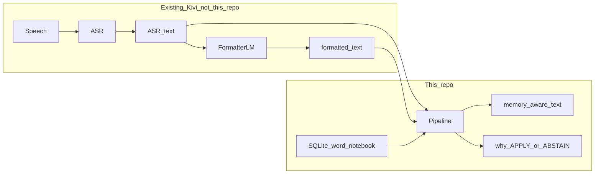
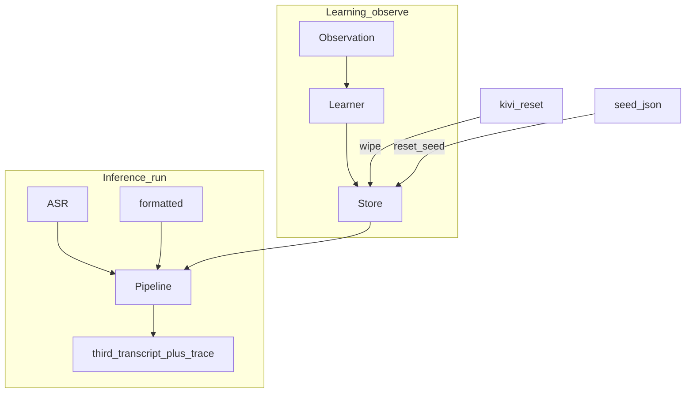
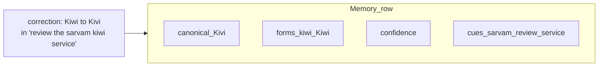
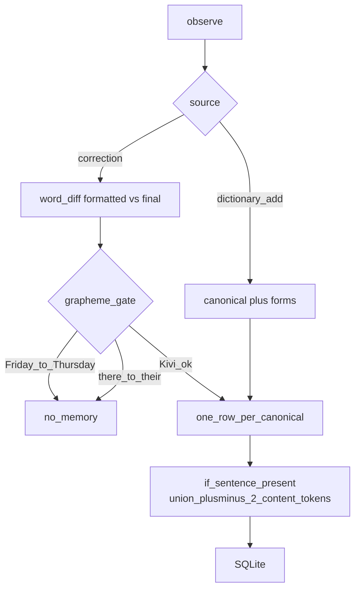
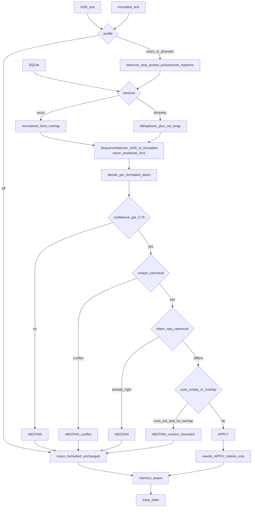
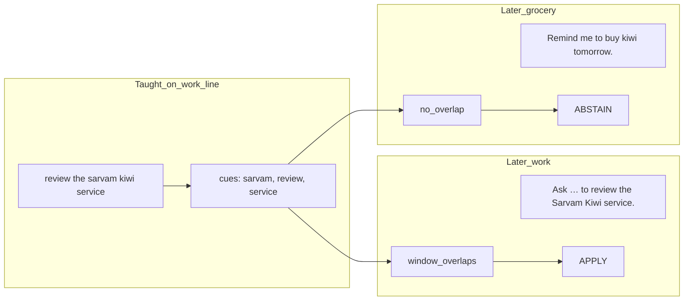
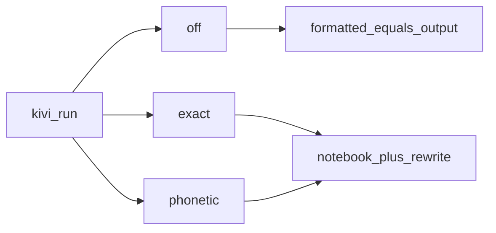
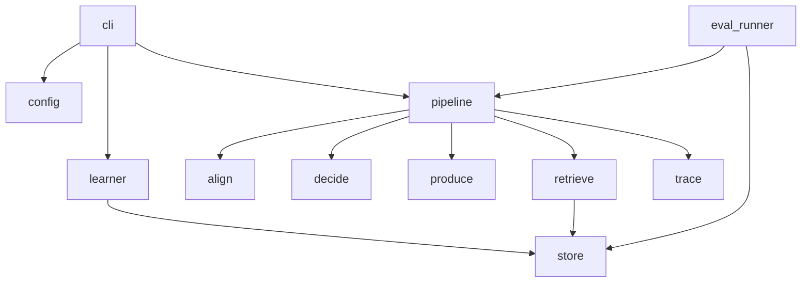
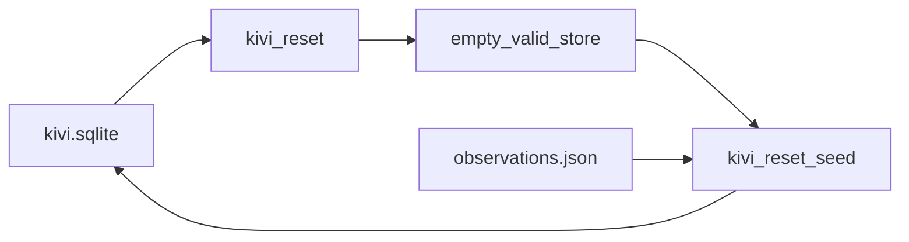

# Kivi Memory Lab

A **per-user word notebook**. Not speech-to-text, not a formatter, not
chat memory, not a knowledge graph.

Kivi already turns speech into **ASR text**, then a language model into
**formatted text**. Those two are inputs. This lab produces the **third**
transcript: this user’s spellings — or it **leaves the line alone**.

```
said      ask akshith to bump postgress and graffana
typed     Ask Akshith to bump postgress and graffana.
written   Ask Akshit to bump Postgres and Grafana.
```

Primary review: local CLI + SQLite. Exact commands: [RUN.md](RUN.md).

---

## What it can distinguish

Doing nothing is half the product. Every row below is a committed eval
case with an asserted reason, not a claim — run
`uv run kivi eval --profiles off,exact,phonetic` to reproduce.

| Situation | What it does | Why |
| --- | --- | --- |
| Taught spelling, matching use (`Akshith` → `Akshit`) | **APPLY** | Asserted evidence, confidence ≥ 0.75, token ≠ canonical |
| Formatter expanded the line (`im gonna ask akshith` → `I'm going to ask Akshith.`) | **APPLY** on `Akshith` only | Alignment is a `SequenceMatcher` diff, never index `i` — `I'm`/`going` are untouched |
| ASR was right, formatter regressed it (`sreenivas` → `Srinivas`) | **APPLY** | `decide` reads the *formatted* token, so it can undo the formatter |
| Brand that is also a common word, wrong context (`buy kiwi at the store`) | **ABSTAIN** `context_mismatch` | Cues from the teach line don't overlap this sentence. One correction on such a line widens the cues and the next one applies |
| Unseen phonetic variant (`kiwi` when only `Kivi` was stored) | `exact` **ABSTAIN**, `phonetic` **APPLY** | Proves the two profiles are not redundant; also proves what Metaphone can't reach (`ksh↔x`, initial `a↔aa`) |
| Already spelled right, or only case differs (`Meera`, `sarvam`) | **ABSTAIN** `already_canonical` | Case is not a correction signal; the formatter owns capitalization |
| Two real people, one surface (`Riya` and `Ria`) | **ABSTAIN** `conflicting_canonicals`, both ids in the trace | Never guess an identity by ranking confidence |
| Content edit or grammar fix (`Friday`→`Thursday`, `there`→`their`) | **Learns nothing**, 0 rows | `there`/`their` scores *higher* (0.80) than `kiwi`/`kivi` (0.75), so a closed refuse list does this, not a threshold |
| Multi-token compound (`blink it` → `Blinkit`) | **ABSTAIN** `no_memory` | One token → one token is the whole abstraction. Out of reach on purpose, not silently mangled |
| Empty, garbage, or script-switched input (`प्रिया ने भेजा`) | **ABSTAIN**, no crash | Cold path is a no-op, which is most real utterances |

---

## What is in the box vs what is outside

We never record audio. We never own the formatter. This lab stands in
for “put the chosen words into formatting”: default `exact` rewrites
APPLY tokens on the formatted line. No model key.



Two clocks, one store:



---

## A memory is a word, not a sentence

Each row is one identity for one user:

| Field | Meaning |
| --- | --- |
| `canonical` | how they write it (`Akshit`, `Postgres`) |
| `forms` | how it has appeared (`akshith`, `postgress`) |
| `confidence` | 1.0 dictionary; 0.85 first correction |
| `context_cues` | ±2 neighbor content words from the teach line |
| `evidence` | which observations created the row |

We do **not** store “Akshit is a colleague” or the whole utterance.

Admission test: if deleting the row cannot change a future transcript’s
wording of a personal term, it is not this memory.



---

## Learning (`kivi observe`)

User-asserted only. No harvesting unusual words from raw ASR.



Same `user_id` + same `canonical` → **merge forms and cues**, do not
duplicate the row. Dictionary add has empty cues by default (no
sentence), so that word can apply anywhere — pass `--context "..."` to
scope it the same way a correction's teach sentence does. Either way,
the gate only activates once a memory has `MIN_CUES_FOR_GATE` (2) or
more cues; fewer than that is treated as too little evidence to trust
(see Limitations).

---

## Inference (`kivi run`) — this is the live path

`--profile` picks the path. Default is `exact`. No API key required.



**Why `kiwi` / `Kivi` needs the cue gate**



Phonetic only **finds** `kiwi` when you stored `Kivi`. Cues decide
whether that find is allowed to rewrite. The same gate also
context-locks ordinary names taught in a short sentence — see
[Limitations](#limitations).

---

## Profiles

| Profile | Retriever | Producer | Status |
| --- | --- | --- | --- |
| `off` | — | pass through | shipped |
| `exact` | string overlap | rewrite | shipped (default) |
| `phonetic` | classic Metaphone + `v↔w` | rewrite | shipped |

Unknown `--profile` errors. It does not fall back.



---

## Decisions

| Decision | Why |
| --- | --- |
| Memory is a lexical row, not a chat log | The brief is phonetic / word-level memory, not personal AI |
| Learn only from Dictionary add or a 1:1 spelling correction | Ordinary use; ASR alone must not write the notebook |
| APPLY iff confidence ≥ 0.75, unique canonical, token ≠ canonical | Weak or conflicting evidence → do nothing |
| First correction is 0.85, not 0.60 | One teach must be enough for the PDF example |
| Neighbor cues on corrections | Separate work `Kivi` from grocery `kiwi` without an entity graph |
| `exact` is the default review path | No key, inspectable, resettable |
| `off` is a profile, not a missing store | Eval can tell “memory did nothing” from “memory is disabled” |
| Alignment is `SequenceMatcher`, never index `i` | Formatters expand contractions and drop fillers |
| No Hugging Face, no vector DB, no entity graph | Out of scope for this edge |

---

## Limitations

- **Alignment** works when ASR and formatted tokens mostly correspond. It degrades on a heavy formatter paraphrase.
- **Grapheme gate** requires the same first letter and a similarity floor. `film` → `vLLM` cannot be learned from a correction; use `dictionary_add`.
- **Homophone refuse list** is closed (`there`/`their`, `your`/`you're`, …). New grammar pairs are not inferred.
- **One token → one token.** Compounds (`fast api` → `FastAPI`) are structural ABSTAIN, not a miss we pretend to fix.
- **Cue gate needs a minimum of evidence.** A name taught in a very short sentence (`Gautam will lead.`) stores only 1 cue — too little to trust as a homograph gate, so `MIN_CUES_FOR_GATE` (2) exempts it and the name applies everywhere, same as a `dictionary_add`. A real homograph teach (`Post the update on Tumblr.`) stores 2+ cues and keeps the gate. This is a floor on evidence, not a proper-noun detector — it was tuned against the measured cue counts in `eval/difficulty_catalogue.md` (D19), not guessed.
- **`dictionary_add` is unscoped by default.** A brand taught via `dictionary_add` (e.g. `Groww`) has no cues and applies in every sentence, including `the plants will grow faster`. Pass `--context "some example sentence"` to scope it — it feeds the same `content_window` mechanism a correction's teach sentence does.
- **Grapheme-similar ≠ same person.** `Sanjay → Sanjeev` passes the correction gate (same first letter, ratio 0.77) and gets learned as if it were a respelling. `--profile phonetic` will also rewrite `Karan` → `Karen` (identical Metaphone key). We measured this looking for a safe guard — edit distance and similarity ratio put the legitimate `Lakshmi/Laxmi` respelling and the `Sanjay/Sanjeev` collision on the same side of every threshold we tried, and `Karan/Karen` has the *same* edit distance (1) as every legitimate respelling. There is no string-similarity rule that separates these without breaking real cases, because the actual signal is speaker identity, which this system does not have. Documented, not silently shipped: see `eval/difficulty_catalogue.md` D16/D17.
- **Phonetic** uses `jellyfish` classic Metaphone (one code), plus a `v↔w` swap so `kiwi`/`kivi` can meet, plus a first-letter rule to kill short-token collisions. It is not Double Metaphone. Unseen transliterations often miss.
- **No online reject loop.** A bad APPLY is not unlearned from a later tap.
- **No formatter-prompt model.** The third transcript is a gated rewrite. Kivi’s real product can still stuff the same APPLY set into its existing LM later; this repo does not call one.

---

## Evaluation

How we evaluate is part of the brief. There is no hidden benchmark.

- Cases: `eval/cases/case_*.json` (setup observations, ASR + formatted, expected APPLY/ABSTAIN, expected text, often expected reasons and affected tokens).
- Runner: isolated SQLite per case, all requested profiles, `off` as the control.
- Metrics, per profile: useful / unnecessary / incorrect APPLY, expected / unexpected ABSTAIN, latency, `model_calls`, store row counts.
- Results (committed): [`eval/results/latest.md`](eval/results/latest.md) and `eval/results/latest.json`.

Command:

```
uv run kivi eval --profiles off,exact,phonetic
```

Latest committed snapshot: **70 pass, 0 fail** on `off` / `exact` / `phonetic`. That report is evidence, not a gallery of successes picked after the fact.

Measured failure modes — 19 real post-ASR difficulty classes (D1–D19) and the 6 hard capability walls (W1–W6) that bound them, each traced to a citation or a transcript of a real run: [`eval/difficulty_catalogue.md`](eval/difficulty_catalogue.md). That file also records the three places where measurement overruled our own plan (§5), including two false APPLYs we could not fix honestly and chose to document instead.

---

## Modules (closed list)

Nothing else ships. Align lives inside `pipeline`, not as a second product.



| Module | Job |
| --- | --- |
| `cli/` | flags, notebook skin, print traces |
| `config.py` | paths, profile names, thresholds |
| `store/` | SQLite, migrate, **reset** |
| `learner/` | observation → memory |
| `retrieve/` | `exact` \| `phonetic` |
| `pipeline/` | wire + ASR↔formatted align |
| `decide/` | per-token APPLY / ABSTAIN + cue gate |
| `produce/` | `passthrough` \| `rewrite` |
| `trace/` | inspectable run record |
| `eval_runner.py` | fixtures × profiles |

---

## Reset and what you ship

Live memory is `data/kivi.sqlite` (not in git). Portable memory is
`data/seed/observations.json`.



After `kivi reset`, `kivi memories` is empty and valid. After
`kivi reset --seed`, memory equals the seed replay, not leftovers.

---

## Libraries

Python **3.13** via **uv** (`uv.lock`). **hatchling** builds the wheel.
We do not use pip as the review path. We do not pull SQLAlchemy,
transformers, Hugging Face, a vector DB, or an agent host.

The only third-party **runtime** library is **jellyfish** (classic
Metaphone for `--profile phonetic`). Everything else is the standard
library so a clone can `uv sync` and run `off` / `exact` with no keys.

| Piece | Kind | What we use it for |
| --- | --- | --- |
| **uv** | toolchain | `uv sync`, `uv run kivi`, lockfile |
| **Python 3.13** | language | whole lab |
| **hatchling** | build | package `src/kivi_memory` |
| **jellyfish** | runtime dep | Metaphone keys in `retrieve/phonetic` |
| **sqlite3** | stdlib | durable notebook; migrate; `reset` |
| **difflib.SequenceMatcher** | stdlib | correction word-diff; ASR↔formatted align |
| **argparse** | stdlib | CLI flags |
| **json** | stdlib | seed, inspect, eval results |
| **pytest** | dev only | `uv run pytest`; not needed to demo |

---

## Commands

See [RUN.md](RUN.md) for the reviewer path. Short list:

```
uv sync
uv run kivi
uv run kivi reset --seed
uv run kivi memories
uv run kivi observe --source correction --asr "…" --formatted "…" --final "…"
uv run kivi run --asr "…" --formatted "…"
uv run kivi eval --profiles off,exact,phonetic
uv run kivi reset
```

---

## AI use

Required by the brief.

**What we decided (not the model):** memory is a lexical belief;
observation ≠ memory; retrieval ≠ apply; ABSTAIN is success; Dictionary
add and correction are the only writes; first correction 0.85; default
profile `exact` with zero env vars; no STT, no vector index, no entity
graph. We did not ship a model producer — the brief allows a local
rewrite as the third transcript.

**What Cursor / Claude wrote:** scaffolding (uv, CLI skin, CI), the
store/learner/pipeline/eval implementation, draft
eval fixtures, and diagrams in this README. Agents did not choose the
product. We threw out generated cases the machine cannot represent
(multi-token compounds, invented Double Metaphone collisions) and kept
what `eval/difficulty_catalogue.md` measured.
