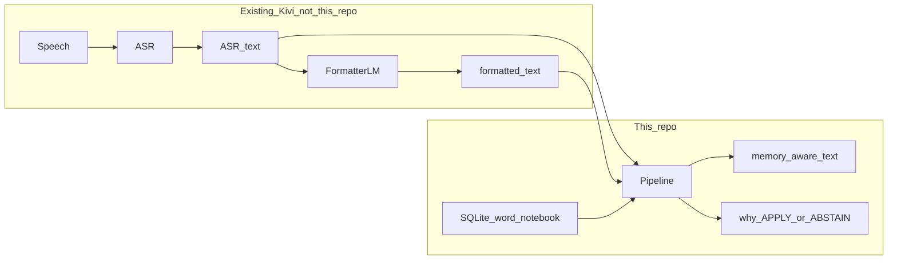
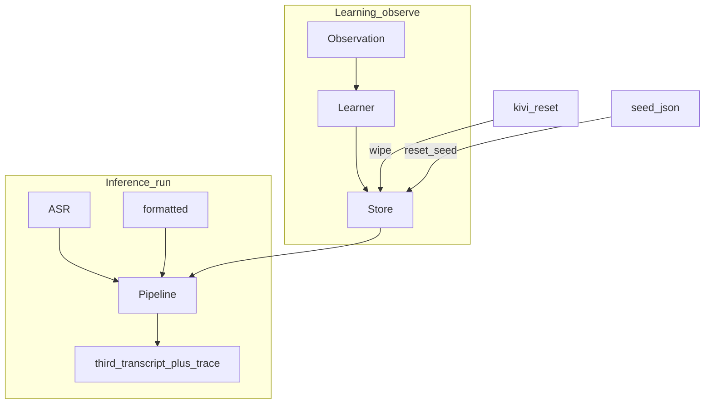
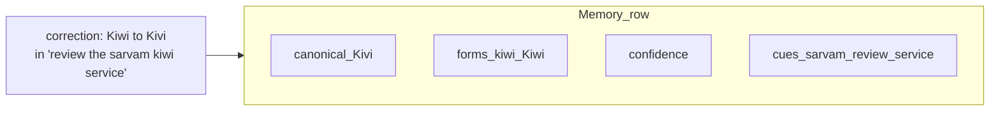
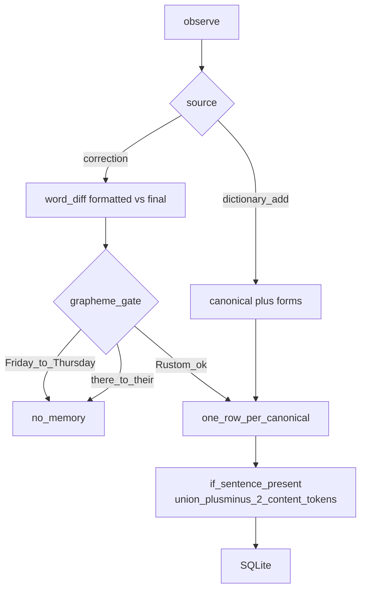
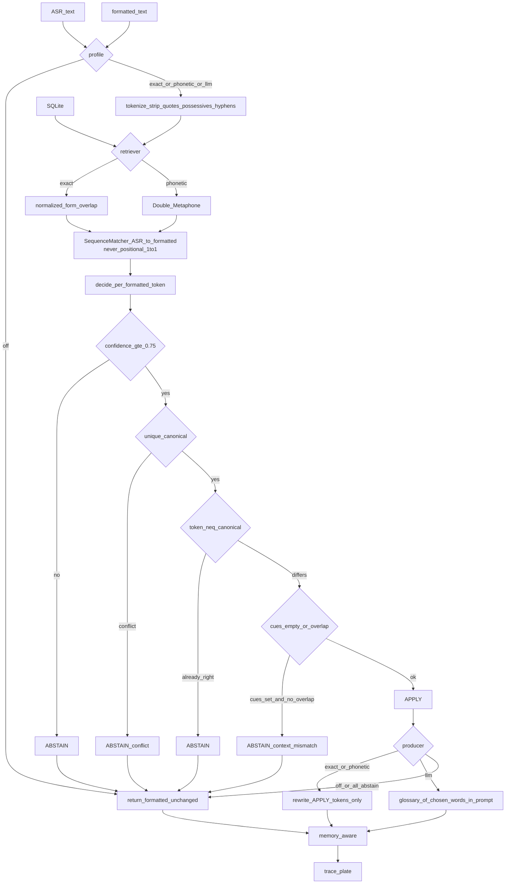
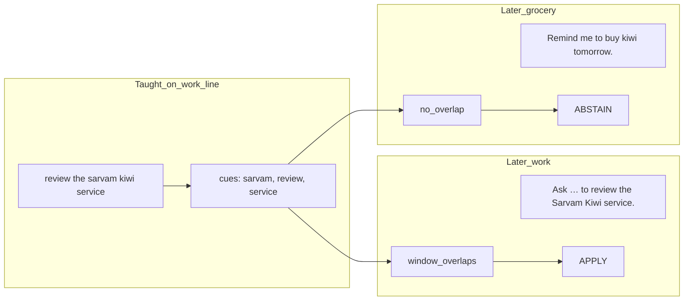
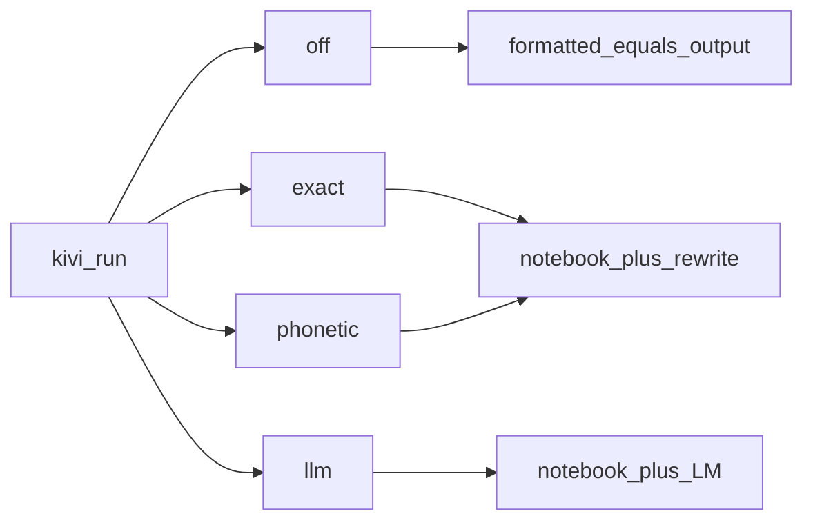
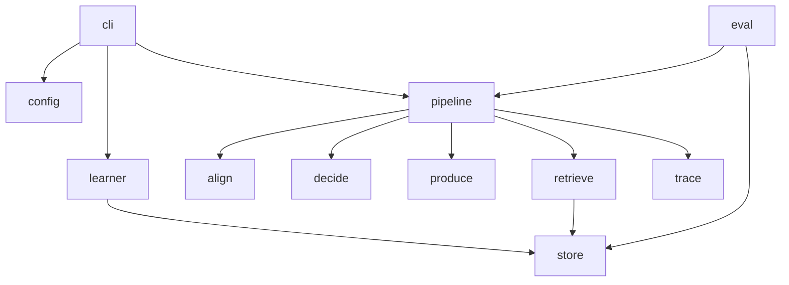
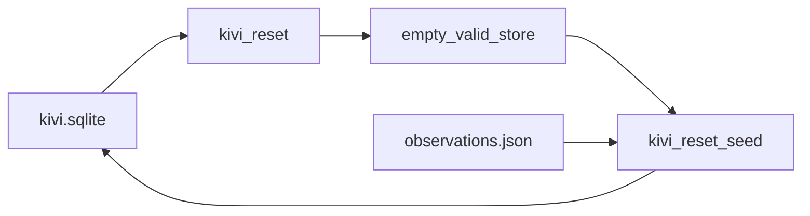

# Kivi Memory Lab

A **per-user word notebook**. Not speech-to-text, not a formatter, not
chat memory, not a knowledge graph.

Kivi already turns speech into **ASR text**, then a language model into
**formatted text**. Those two are inputs. This lab produces the **third**
transcript: this user’s spellings — or it **leaves the line alone**.

```
said      rustam called from nilgiri
typed     Rustam called from Nilgiri.
written   Rustom called from Nilgiri.
```

Primary review: local CLI + SQLite. Exact commands: [RUN.md](RUN.md).
Full contracts: [plan.md](plan.md).

---

## What is in the box vs what is outside

We never record audio. We never own the formatter. Memory is **found
and used as if it were placed in the formatting prompt**. The rewriter
and the optional LLM producer are stand-ins for that.



Two clocks, one store:



---

## A memory is a word, not a sentence

Each row is one identity for one user:

| Field | Meaning |
| --- | --- |
| `canonical` | how they write it (`Rustom`, `Kivi`) |
| `forms` | how it has appeared (`rustam`, `kiwi`) |
| `confidence` | 1.0 dictionary; 0.85 first correction |
| `context_cues` | ±2 neighbor content words from the teach line |
| `evidence` | which observations created the row |

We do **not** store “Rustom is a friend” or the whole utterance.



---

## Learning (`kivi observe`)

User-asserted only. No harvesting unusual words from raw ASR.



Same `user_id` + same `canonical` → **merge forms and cues**, do not
duplicate the row.

---

## Inference (`kivi run`) — this is the live path

`--profile` picks the path. Default is `exact`. No API key required.



**Why `kiwi` / `Kivi` needs the cue gate**



Empty cues (dictionary add with no sentence) → no gate. That word
applies anywhere.

Phonetic only **finds** `kiwi` when you stored `Kivi`. Cues decide
whether that find is allowed to rewrite.

---

## Profiles

| Profile | Retriever | Producer | Key |
| --- | --- | --- | --- |
| `off` | — | pass through | no |
| `exact` | string overlap | rewrite | no |
| `phonetic` | Metaphone | rewrite | no |
| `llm` | exact | memories in a format prompt | optional |

Unknown `--profile` errors. It does not fall back.



---

## Modules (closed list)

Nothing else ships. Align lives inside `pipeline`, not as a second
product.



| Folder | Job |
| --- | --- |
| `cli/` | flags, notebook skin, print traces |
| `config/` | paths, profile names, thresholds |
| `store/` | SQLite, migrate, **reset** |
| `learner/` | observation → memory |
| `retrieve/` | `exact` \| `phonetic` |
| `pipeline/` | wire + ASR↔formatted align |
| `decide/` | per-token APPLY / ABSTAIN + cue gate |
| `produce/` | `passthrough` \| `rewrite` \| `llm` |
| `trace/` | inspectable run record |
| `eval/` | fixtures × profiles |

---

## Reset and what you ship

Live memory is `data/kivi.sqlite` (not in git). Portable memory is
`data/seed/observations.json`.



---

## Libraries and modules

The runtime is **Python 3.13** installed and locked by **uv** (`uv.lock`).
**hatchling** only builds the wheel. We do not use pip as the review
path, and we do not pull SQLAlchemy, transformers, Hugging Face, a
vector DB, or an agent host.

The only third-party **runtime** library is **jellyfish**: Double
Metaphone for the `phonetic` profile. Everything else is the standard
library on purpose so a clone can `uv sync` and run `exact` / `off`
with no keys.

| Piece | Kind | What we use it for |
| --- | --- | --- |
| **uv** | toolchain | `uv sync`, `uv run kivi`, lockfile |
| **Python 3.13** | language | whole lab |
| **hatchling** | build | package `src/kivi_memory` |
| **jellyfish** | runtime dep | Metaphone keys in `retrieve/phonetic` |
| **sqlite3** | stdlib | durable notebook; migrate; `reset` |
| **difflib.SequenceMatcher** | stdlib | correction word-diff; ASR↔formatted align (never 1:1 index) |
| **argparse** | stdlib | CLI flags and subcommands |
| **json** | stdlib | seed, inspect, eval results |
| **dataclasses / pathlib / datetime** | stdlib | records, paths, timestamps |
| **os / sys** | stdlib | `NO_COLOR`, `--plain`, process exit |
| **pytest** | dev only | `uv run pytest`; not needed to demo |
| **Gemini / Groq HTTP** | optional, not a pinned dep yet | `--profile llm` only; skipped if no key |

**Our packages** (closed list — do not add folders):

| Module | Use |
| --- | --- |
| `cli/` | flags, notebook skin, print |
| `config` | paths, profiles, thresholds |
| `domain/` | Memory, Observation, protocols |
| `store/` | SQLite + schema |
| `learner/` | explicit observe; grapheme gate; neighbor cues |
| `retrieve/` | exact overlap; phonetic |
| `pipeline/` | wire + align |
| `decide/` | APPLY / ABSTAIN + context mismatch |
| `produce/` | passthrough, rewrite, llm |
| `trace/` | inspectable run plate |
| `eval/` | fixtures × profiles |

---

## Commands

```
uv sync
uv run kivi
uv run kivi observe …
uv run kivi memories
uv run kivi run --asr "…" --formatted "…" --profile exact
uv run kivi eval --profiles off,exact,phonetic,llm
uv run kivi reset
uv run kivi reset --seed
```

`--plain` / `NO_COLOR` turn off the skin.

Eval, seed fixtures, and some commands are still landing in stages
([HANDOFF.md](HANDOFF.md)). The diagrams above are the **target**
system the submission must match, not a second architecture.
