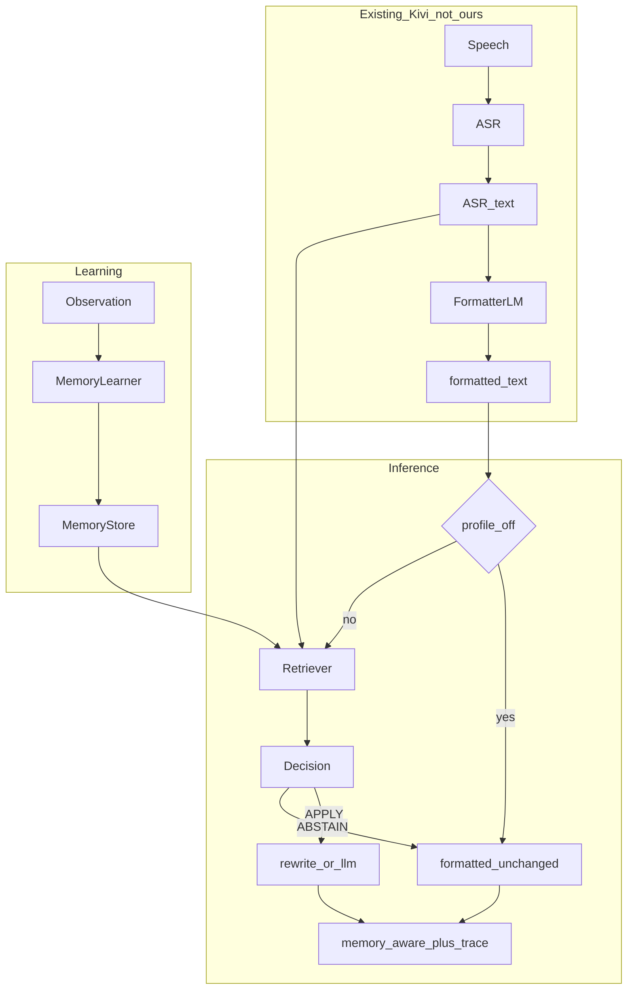

# Kivi Memory Lab — Plan (final submission)

This is the **submission plan**, not a V0 scratchpad. Implement what is
named here. Do not add a module because it is fashionable. Eval
**metrics** wait until train/test fixtures exist; dataset gathering
comes first.

Grounded in `Kivi_Backend_Full_Stack_Task_Clean_Cover.pdf`.

---

## Final delivery (what we submit)

Primary review method: **completely local CLI + SQLite**, managed with
**uv**. No host, no Docker. **No API key required** for the default
profile. An LLM key is optional and only used when that profile is
toggled on.

The reviewer clones one commit, follows `RUN.md`, and can:

1. `uv sync` (lockfile committed; do not use pip as the review path)
2. create / migrate / seed SQLite
3. `observe` (dictionary add or correction)
4. `memories` (inspect store)
5. `run` (paste ASR + formatted → memory-aware text + why)
6. `eval` (reproducible cases, including deliberate no-ops)
7. `reset` and repeat the same journey

Repo must contain, from the brief:

| Required | Path |
| --- | --- |
| Source | `src/kivi_memory/` |
| Runnable demo | `kivi` CLI |
| Schema + migrations | `src/kivi_memory/store/schema.sql` |
| Seed | `data/seed/observations.json` |
| Eval + dataset | `eval/cases/` |
| Generated results | `eval/results/` |
| Product writeup | `README.md` |
| Reviewer script | `RUN.md` (starts with the primary method) |
| Toolchain | `uv` + `uv.lock` + `pyproject.toml` |
| Optional LLM config | `.env.example` (`KIVI_LLM_API_KEY`, `KIVI_LLM_MODEL`) |

We are **not** delivering STT, a formatter LM, a web UI, embeddings, a
vector DB, a knowledge graph, or a personal-AI memory.

**Expected product output** (after two teaches):

```
ASR:        ask aditya to review the sarvam kiwi service
formatted:  Ask Aditya to review the Sarvam Kiwi service.
memory:     Ask Aaditya to review the Sarvam Kivi service.
decision:   APPLY
```

**Expected no-op output** (no relevant memory):

```
formatted == memory-aware
decision:   ABSTAIN
```

That third transcript plus an inspectable reason *is* the assignment
output. Memory is a **feature toggle**. Eval cross-compares four
profiles on the same cases (see
[Feature toggles and version compare](#feature-toggles-and-version-compare)).

---

## Systems modules (do not invent more)

Every box has one job, a typed contract, and a replaceable
implementation. If a folder does not map to a box below, it does not
ship.

```
cli            I/O only. Parses flags, prints traces. No policy.
config         Profiles, paths, env. Knows off|exact|phonetic|llm.
store          SQLite: migrate, read/write, **reset**, optional export.
learner        Observation → memory upserts or no-op. `explicit` only.
retrieve       Text + store → candidates. `exact` | `phonetic`.
align          (in pipeline, not a product) SequenceMatcher ASR↔formatted.
               Decide only on formatted tokens aligned to a flagged span.
               Never positional 1:1.
decide         Aligned formatted tokens → per-token APPLY|ABSTAIN.
produce        Formatted + decision → third transcript. `passthrough` |
               `rewrite` | `llm`.
pipeline       Wires the gate + the four slots. One place.
trace          Builds the inspectable run record.
eval           Loads cases, isolates DB, runs profiles, writes results.
```

Rules for adding a module: name the failing case, the contract, and the
false APPLY it could create. No case → no module.

**Not modules (do not create):** Hugging Face client, Spaces deploy,
trainer, vector index, entity graph, global relationship store, ASR,
formatter LM, web UI, agent host.

### Memory shipping and the reset switch

Shipped memory is **not** a model checkpoint.

| Artifact | Role | Git |
| --- | --- | --- |
| `data/seed/observations.json` | How a user’s words are recreated | yes |
| `eval/cases/` | Held-out situations + expected behaviour | yes |
| `data/kivi.sqlite` | Live store after observe/learn | **no** (generated) |
| `kivi reset` | Switch: wipe live store | command |
| `kivi reset --seed` | Wipe + replay seed observations | command |

Reset must be deterministic: after `reset`, `memories` is empty and
well-formed. After `reset --seed`, memory equals the seed replay, not
leftovers from the last demo.

The reviewing agent will use reset to repeat the journey. If reset
leaves rows, the submission fails the brief.

```
uv run kivi reset           # wipe
uv run kivi reset --seed    # wipe + seed
uv run kivi memories        # must be empty after wipe
```

No extra “memory service.” The file + these commands *are* shipping.

### Hardware and keys (this machine, 2026-09-06)

Measured here: i7-12700H (20 threads), **16 GB RAM** (~5–6 GB free),
Intel iGPU + **RTX 3050 Mobile** with **NVIDIA driver not working**
(`nvidia-smi` fails, `torch.cuda` is false), ~370 GB disk.

| Ask | Decision | Why |
| --- | --- | --- |
| Deploy on Hugging Face? | **No** | Review method is local CLI. A Space is a second product the agent will not infer. |
| Hugging Face token? | **No** | We are not downloading gated weights or hosting an endpoint. |
| Local 7B / transformers? | **No** | No usable GPU; 16 GB RAM + swap would thrash; reviewer may have less. |
| OpenAI paid key? | **No** | Student budget. Not required. |
| Required key for default review? | **None** | `off` / `exact` / `phonetic` are CPU + `jellyfish`. |
| Optional key for `llm` profile? | **Gemini Flash (free tier)** or Groq free Llama | Open, cheap, HTTP only. Eval SKIPS `llm` if unset. |

`.env.example`:

```
# optional — only for --profile llm
KIVI_LLM_API_KEY=
KIVI_LLM_MODEL=gemini-2.0-flash
# KIVI_LLM_BASE_URL=   # only if using an OpenAI-compatible free host
```

Do not add `huggingface-hub`, `transformers`, or CUDA wheels to
`pyproject.toml`.

Keys we personally hold must **not** change the default review path.
`exact` stays zero-env-var. Optional keys may generate dataset drafts
or run `--profile llm`. The coding agent following RUN.md will not
have our keys.

---

## Pinned contracts (external review — accept / defend)

A review of this plan said several pass/fail terms were labels, not
checks, and that token alignment was unspecified. We **accept** the
engineering fixes. We **defend** one product number.

### 1. Token alignment (accepted — this would have broken)

Do **not** assume ASR token count equals formatted token count.
Formatters add punctuation, expand contractions, drop fillers, merge
`gonna` → `going to`. Positional index-matching mutates the wrong word.

Contract:

1. Tokenize ASR and formatted separately (see punctuation strip below).
2. Align with `difflib.SequenceMatcher` on **normalized** tokens
   (same helper as learner diffs). Not raw index.
3. Retriever may flag a memory from ASR surfaces, formatted surfaces,
   or (phonetic) encodings of either.
4. **Decide runs only on formatted tokens** whose aligned ASR span
   or whose own surface was flagged. Unaligned formatted-only tokens
   (pure formatter insertions) are ABSTAIN unless they themselves
   exact-match a memory surface.
5. Produce rewrites those formatted tokens only.

Required fixture: ASR `im gonna ask aditya` → formatted
`I'm going to ask Aditya.` Memory `Aaditya`. Must APPLY only `Aditya`,
not `I'm` / `going`.

README **must** state the limitation: alignment works when tokens
mostly correspond via diff; it degrades on heavy formatter rewrites
(full paraphrase). Reviewers look for this admission.

### 2. Confidence numbers (accepted pin; defend the first-correction value)

Without numbers, family 5 cannot be authored.

```
APPLY iff confidence >= 0.75   # inclusive; test confidence == 0.75

dictionary_add:               1.00
correction (gate passed):     0.85 on first evidence
                              +0.05 per later same-canonical correction
                              cap 1.00
seeded weak (eval only):      0.40
seeded just-below (eval only): 0.60  # for threshold-crossing fixture
```

**Defend:** a review suggested first correction = 0.6 so it sits under
0.75. That would make the PDF example **ABSTAIN after one teach** and
contradict Kivi’s “fix it once” feel. Weak ABSTAIN is a **seeded**
0.40 row, not a punished real correction. Threshold-crossing is tested
by seeding 0.60 then replaying one correction → 0.85 → APPLY.

Same `user_id` + same `canonical`: **merge** forms (union), do not
insert a second row.

### 3. Conflicting canonicals (accepted — make it a check)

Conflict when two memories for the same `user_id` share a
**normalized** observed form (or canonical-as-form) and disagree on
`canonical`. Every formatted token whose normalized surface is that
shared form → **ABSTAIN**, reason `conflicting_canonicals`, list both
ids. Do not pick the higher confidence.

### 4. Grapheme gate + `there→their` (accepted hole)

Edit distance cannot tell `Aditya→Aaditya` from `there→their`.
Learn a correction pair only if **all** hold:

1. not case-only
2. grapheme-similar (existing distance / first-letter rule)
3. pair is not in `REFUSE_HOMOPHONE_PAIRS` (closed list: there/their,
   your/you're, its/it's, to/too, two/too, than/then, …)
4. not both tokens in `COMMON_FUNCTION_WORDS`

Required negative fixture: formatted `there` → final `their` →
**no memory**. Friday→Thursday stays as the content-edit reject.

Limitation (README): the refuse list is closed and incomplete; we do
not claim semantic understanding of grammar fixes.

### 5. Tokenizer (accepted)

Before normalize/match: strip wrapping quotes; strip possessive
`'s` / `’s`; treat hyphenated `Sarvam-Kivi` as the full token **and**
the segments. Otherwise `Kivi's` silently misses.

### 6. LLM profile determinism (accepted)

`temperature=0`, model string **pinned** in RUN.md / `.env.example`,
hard timeout (e.g. 20s). Network/timeout → eval status `FAILED` or
`SKIPPED` with reason — **no hang**. Missing key → `SKIPPED`, not
FAIL, and **never** change default `exact`.

Dataset generation may use any personal API with structured JSON.
That is an authoring aid, not a runtime dependency.

### 7. Unknown `--profile` (accepted)

`--profile foo` → non-zero exit, list valid names, no silent fallback.

### 8. Neighbor context (gap closed — still not sentence memory)

`kiwi` fruit vs `Kivi` product is the same surface. A word notebook
that ignores neighbors will APPLY the product spelling on a grocery
line. That is a real product miss. We **do not** store the sentence
or a graph. We store **cues**.

On learn (correction with formatted/ASR text):

- take ±2 **content** tokens around the edited span (drop a tiny
  stoplist: the, a, an, to, of, and, for, on, in, …)
- union them onto that memory as `context_cues`
- dictionary_add with **no** sentence → empty cues (user asserted
  the word globally; no context gate)

On decide, for a token that otherwise would APPLY:

- window = ±2 content tokens around that formatted token
- if the memory has **no** cues → APPLY (unchanged)
- if it has cues and **none** overlap the window (normalized) →
  **ABSTAIN**, reason `context_mismatch`
- if at least one cue overlaps → APPLY

Required pair:

```
taught on:  review the sarvam kiwi service  →  cues like sarvam, review, service
work line:  Ask Aditya to review the Sarvam Kiwi service.  →  APPLY Kivi
grocery:    Remind me to buy kiwi tomorrow.               →  ABSTAIN
```

This is a gate on the same lexical row. It is not sentence memory.
README: cues are a small bag; they fail if the teach sentence and the
new sentence share no content words.

---

## Datasets and edge cases (gap — fill before metrics)

We do **not** train a model. “Train” = seed observations that create
memory. “Test” = held-out `(asr, formatted)` runs + expected
APPLY/ABSTAIN. Metrics discussion waits until these files exist.

Current gap: only the brief’s one sentence. That is not an evaluation.

### Train (seed) families to write

| id | What the user asserted | Why |
| --- | --- | --- |
| seed_brief | Aaditya + Kivi from the PDF pair | required example |
| seed_indian_names | 8–15 spelling variants (Priya/Priyaa, Ravi/Ravee, …) | real Kivi users |
| seed_brands | product/org vs common English (Kivi/kiwi, …) | lexical identity |
| seed_dictionary | explicit dictionary_add rows | strong evidence |
| seed_content_edit | Friday→Thursday (must **not** become memory) | learner gate |

### Test (eval case) families to write

Must go **beyond** the one PDF example. Each case: inputs, expected
decision, expected text (per profile where it differs), setup
observations or seeded rows.

1. Useful APPLY (taught brief example) — `off` stays formatted
2. Useful APPLY (two names in one sentence)
3. Deliberate no-op (common sentence, empty store)
4. Irrelevant memory in store (grocery vs work)
5. Weak / low-confidence overlap → ABSTAIN
6. Observe ASR+formatted only → no memory
7. Content edit Friday→Thursday → no memory
8. Conflicting canonicals → ABSTAIN
9. Empty / garbage input → ABSTAIN, no crash
10. Phonetic-only: stored `Kivi`, ASR `kiwi`, form never stored —
    `phonetic` APPLY, `exact` ABSTAIN
11. Word-boundary (no match inside `Kivimaki`)
12. Cold start / after reset → all no-op
13. Duplicate observe → idempotent
14. Already-canonical formatted token → ABSTAIN
15. Multi-user isolation (`user_id` A must not fix user B)
16. Code-switch / Latin-script Indian name in mixed sentence
17. Token-count mismatch (ASR `im gonna ask aditya` → formatted
    `I'm going to ask Aditya.`) — alignment, not positional
18. Punctuation-attached (`Kivi's`, `Sarvam-Kivi`, `"Kivi"`)
19. Multiple mentions, one sentence
    (`Aditya asked Aditya to call Aditya`) — per-token, not
    all-or-nothing
20. Sentence-initial capitalization vs mid-sentence `kivi` —
    case is not a correction signal
21. Short-token phonetic false positive (Ravi / Robbie-style
    Metaphone collision) — `phonetic` must not over-APPLY
22. Repeated `dictionary_add`, same canonical, new form (`kiwi` then
    `Kivvy`) — one row, unioned forms
23. Reinforcement crossing threshold (seed 0.60 → second correction
    0.85 → now APPLY)
24. Invalid `--profile foo` — clear error, no crash, no fallback
25. Formatter introduced the error (ASR already `Aaditya`, formatted
    `Aditya`) — decide is formatted vs memory
26. Confidence exactly `0.75` — APPLY (`>=`, not `>`)
27. Homophone grammar `there→their` — must **not** learn
28. Context APPLY: taught `Kivi` on a work sentence; work line APPLY
29. Context ABSTAIN: same memory; grocery `buy kiwi` must not become
    `Kivi`

Families 10, 11, 15 stay. 17–21 are what a reviewing agent will hit
while poking the CLI.

Do not invent more families until these exist as JSON. Do not tune
aggregate metrics until the JSON exists. Numbers above are **pass/fail
thresholds**, not the later metrics discussion.

---

## Gemini research prompt (copy-paste)

Use this to gather **fixtures and citations**, not architecture.
Paste the model’s useful lists into `eval/cases/` drafts. Do not let
it talk you into a vector DB.

```
You are helping design an evaluation dataset for a word-level
personalized speech-to-text memory system (not generic RAG memory).

Product: Kivi. Pipeline: speech → ASR text → formatter LM →
memory-aware text. We do not build ASR. We receive ASR + formatted
and must output the user's personal written forms (names, products,
orgs, jargon) or deliberately do nothing.

The only official example:
  ASR: ask aditya to review the sarvam kiwi service
  formatted: Ask Aditya to review the Sarvam Kiwi service.
  memory-aware: Ask Aaditya to review the Sarvam Kivi service.

I need research and concrete items I can turn into JSON fixtures.

Please cover, with short explanations and sources where you can:

1. Typical ASR + formatter failure modes for personal vocabulary
   (homophones, common-word capture, Indian-name transliteration,
   brand vs generic noun). Give 20+ example triples:
   asr | formatted | correct memory-aware.

2. Indian / South Asian given names and surnames with multiple Latin
   spellings that sound alike (e.g. Aditya/Aaditya, Aaditya/Adithya/
   Aditi). For each: surfaces an ASR might emit, the user's likely
   canonical, and when the system should ABSTAIN (two people).

3. Brand / product / org names that collide with English words
   (kiwi/Kivi, and 10+ others). Mark which need context to avoid
   false APPLY.

4. Corrections that must NOT become memory (content edits, tone,
   grammar, Friday→Thursday). Give 10 pairs.

5. Standard techniques in this narrow area only: lexicon biasing,
   phonetic encodings (Metaphone/Soundex/G2P), LM glossary-in-prompt.
   4–6 lines each: what they fix, what they break. Do not recommend
   knowledge graphs, session memory, or embedding chat history.

6. Public datasets or papers I can cite (names corpora, ASR error
   studies, Indic transliteration). I cannot download huge audio.
   Text pairs are enough.

7. A proposed split: ~30 seed observations (train) vs ~40 held-out
   run cases (test), tagged apply | noop | abstain | phonetic-only |
   conflict. No metrics formulas yet.

Output as markdown tables I can copy. Prefer Indian-English and
workplace dictation. No audio, no code, no system redesign.
```

---

## Submission requirements (verbatim target from the brief)

Aim development at this review path. The coding agent clones **one
commit SHA** and follows **only** `RUN.md`. It will not infer setup,
use undocumented dashboards, repair the app, or ask us questions.

### One repository must contain

| Brief item | Our target |
| --- | --- |
| Complete source code | `src/kivi_memory/` |
| Runnable demonstration | `uv run kivi` CLI |
| Database schema and migrations | `src/kivi_memory/store/schema.sql` (+ apply on first open) |
| Reproducible seed data | `data/seed/observations.json` |
| Complete evaluation and its dataset | `eval/cases/` + runner |
| Generated evaluation results | `eval/results/` **committed on the submitted SHA** |
| README: product, architecture, decisions, limitations, **AI use** | `README.md` |
| RUN.md: primary review method + exact how-to | `RUN.md` (first line = method) |

Optional but useful: `plan.md`, `uv.lock`, `tests/`.

### Allowed arrangements (we pick one)

Application may be: fully hosted; **completely local**; local UI + hosted
backend; local + hosted DB; containerised; another reproducible hybrid.

Database may be: **SQLite / DuckDB / embedded**; local Postgres/MySQL;
Docker DB; Supabase/Neon/Railway; hosted-app DB.

All valid. **Deployment is not required.**

**Our primary review method (state this as the first sentence of RUN.md):**

> Completely local application. Python 3.11+ via uv. SQLite file on disk.
> Default profile needs no environment variables. Optional
> `KIVI_LLM_API_KEY` / `KIVI_LLM_MODEL` enable the `llm` profile.
> No hosted URL.

Do not switch to hosted/Docker/Neon unless we change this sentence.

### RUN.md — local / hybrid (all 10 required)

1. Required runtimes and versions — e.g. Python 3.11+, `uv` 0.4+
2. Every required environment variable — default: **none**. Optional:
   `KIVI_LLM_API_KEY`, `KIVI_LLM_MODEL` (and `.env.example`). Eval must
   not fail the default profile if the key is missing.
3. Exact commands to install dependencies — `uv sync`
4. Exact commands to create, migrate, and seed the database —
   `uv run kivi reset --seed` (or equivalent, written exactly)
5. Exact commands to start every required process — CLI is the process;
   `uv run kivi --help` is enough if no daemon
6. URL, window, or interface to open — terminal; no URL
7. Primary interactions to try — observe, memories, run (PDF example),
   inspect why APPLY/ABSTAIN, reset, repeat
8. Exact command to run the evaluation —
   `uv run kivi eval --profiles off,exact,phonetic,llm`
9. Where evaluation results are written — `eval/results/latest.json`
   and `eval/results/latest.md`
10. Exact procedure for resetting — `uv run kivi reset` (and how to
    reseed)

If an LLM key is ever required: name the env var precisely, include
`.env.example`, **do not commit private credentials**.

### README must explain

- the product (word-level memory, three transcript levels)
- architecture (learn vs infer, replaceable slots, **ASR↔formatted
  alignment via SequenceMatcher**)
- decisions (why exact default, why first correction is 0.85, why
  abstain, why no STT)
- limitations (alignment degrades on heavy paraphrase; closed
  homophone refuse list; phonetic over-fire on short tokens;
  neighbor cues miss if teach and run share no content words;
  no reject loop)
- **AI use** (what Cursor/Claude wrote; what we decided)

### Demo the reviewer must be able to drive (Part One)

- provide the observations the system learns from
- inspect the resulting memory state
- provide **new ASR and formatted** outputs
- see the memory-aware result
- understand **why** it did or did not intervene
- reset the system and repeat the journey

CLI is allowed. Does not need to look like production Kivi.
Speech recognition is **not** required.

### Evaluation the reviewer will run (Part Two)

They run **our** eval. There is no hidden benchmark.

Every case must preserve:

- the inputs
- the expected result
- the actual result
- the relevant memory state
- the reason for the decision

Report **useful** interventions separately from **unnecessary** or
**incorrect** ones. Include latency, model usage, cost, and database
growth where they matter (V0: latency + store growth; model/cost = 0).

Must be reproducible. A gallery of successes picked after the fact is
**not** an evaluation.

They will score:

- whether the eval tests the actual product claim
- whether it distinguishes useful learning from false/unnecessary APPLY
- whether cases go **beyond** the Aditya/Kivi example
- whether conclusions are backed by reproducible evidence
- whether memory state and decisions are inspectable
- whether latency, cost, and storage are measured honestly

They assess **system + eval method together**. A pretty result with a
weak eval is weak work.

### Application form (after the repo is ready)

- GitHub repository URL
- **exact final commit SHA**
- hosted app URL — omit; we are local

### Pre-submit dry run (do this on the SHA you will send)

From a clean clone of that commit, with only what RUN.md says:

1. `uv sync`
2. create/migrate/seed
3. drive the six demo steps
4. `uv run kivi eval` — results land where RUN.md says
5. reset and repeat

If an agent cannot start, operate, reset, and evaluate unattended, they
may not review.

Closing line of the brief, still the product rule:

> Do not build the largest memory system you can describe.
> Build the smallest one that makes Kivi feel as though it has met this
> person before.

---

## What this memory is (do not grow it)

A memory is a **per-user lexical belief**:

- `canonical` — how this user writes the word (`Aaditya`, `Kivi`)
- `observed_forms` — how it has appeared (`aditya`, `Aditya`, `kiwi`)
- `confidence` + pointers to observations

Admission test: if deleting the row cannot change a future transcript’s
wording of a personal term, it is not this memory.

Not a memory: “Aaditya is a colleague”, chat history, embeddings of
sentences, user profiles, spellcheck, unusual-word harvest.

Kivi already has a Dictionary. A dictionary add is a **strong
observation**, not a second product.

### Entity-level + global + relationships — discussed, not this submission

Proposal: per-user **entity** objects (person, product, org) plus a
**global** memory, so we can draw relationships (Aaditya—works_at—Sarvam,
Kivi—is_product_of—Sarvam).

**What is already true in V0:** one memory row *is* a lexical entity.
`Aaditya` with forms `aditya`/`Aditya` is an identity. `user_id` is
already per-user isolation. Renaming the table to `entities` does not
add product power.

**Where a richer entity would actually help this assignment:**

- two people, same sound (`Aaditya` vs `Adithya`) — need identity split
- same spelling, two meanings (`kiwi` fruit vs `Kivi` product) — need
  context, not a friend-graph
- a **global read-only lexicon** (company/product names) that a user’s
  memory can override — close to Kivi’s existing Dictionary / “shared
  terms,” and still word-level

**Where it becomes the wrong product:**

- `Aaditya is a colleague` does not change `Aditya` → `Aaditya`
- a global graph of people/orgs is semantic/episodic memory — the brief
  says that vision exists and this task is **not** it
- relationship edges invite RAG, embeddings, and “extract everything”
- two stores (user + global) plus join tables blow the review path and
  the eval (whose memory fired? leaked across users?)

Decision for this deadline:

| Layer | Do |
| --- | --- |
| Lexical entity = one memory, many forms, one `user_id` | YES (V0) |
| `kind` field (name/product/term) | NO until an eval needs it |
| Global shared lexicon | LATER, read-only, user overrides; not a graph |
| Relationship / knowledge graph | NO — document as out of scope |
| Neighbor cues on a memory (±2 content tokens) | YES — decide gate, not a new product |

If we ever add global terms: they are more surfaces for the same
*word* problem (`Kivi`), not edges between people. Retrieval stays
“which written form?”, not “what is true about this user?”

---

## Feature toggles and version compare

Memory is not always-on. The same store and the same eval cases run
under named **profiles** so we can see what each technique actually
buys.

### Why not only exact rewrite?

Exact + rewrite is the correct **baseline**, not the whole claim. The
brief’s own insertion point is “place memory into the **formatting
prompt**.” The hard cases in this area (names, brand/common-word
collisions) are usually attacked with two standard tools, not a
knowledge graph:

| Technique | What it is in the field | What we do with it |
| --- | --- | --- |
| Lexicon / dictionary apply | ASR & product dictionaries; bias lists | `exact` + `rewrite` |
| Phonetic encoding | Double Metaphone, Soundex, G2P — name matching, record linkage, n-best rescoring | `phonetic` retriever |
| Glossary-in-prompt | Constrained / instructed LM formatting — **what the brief describes** | `llm` producer |
| Memory **off** | Ablation | prove the layer did something |

We are **not** adding vector RAG over transcripts, an entity graph, or
an LLM that harvests facts into APPLY fuel. Those are common in
“personal AI memory” and still the wrong edge.

### Profiles (implement these four)

| Profile | Memory | Retriever | Producer | Needs key | What it answers |
| --- | --- | --- | --- | --- | --- |
| `off` | OFF | — | pass-through | no | What does the formatter already emit? |
| `exact` | ON | exact / normalized | deterministic rewrite | no | Does asserted memory + exact hit fix the PDF example? |
| `phonetic` | ON | Double Metaphone (e.g. `jellyfish`) + same conservative decide | rewrite | no | Can we retrieve `kiwi` when only `Kivi` was stored? |
| `llm` | ON | exact | memories **in a format prompt**; LM emits memory-aware text | yes, optional | Does prompt injection beat blind rewrite (plurals, casing)? |

Default for `kivi run` and for the reviewer’s first path: **`exact`**.
Always works with `uv sync` and no secrets.

`off` is not a toy. Every APPLY case must also be run with `off` so we
can report: formatted vs memory-aware, and that `off` equals formatted.

### CLI / env (exact names)

```
uv run kivi run --asr "..." --formatted "..." --profile exact
uv run kivi run ... --profile off
uv run kivi run ... --profile phonetic
uv run kivi run ... --profile llm

uv run kivi eval --profiles off,exact,phonetic,llm
```

Equivalent env (optional): `KIVI_PROFILE=exact`.

LLM only:

- `KIVI_LLM_API_KEY` — required **only** for `--profile llm`
- `KIVI_LLM_MODEL` — default documented in RUN.md / `.env.example`
- If the key is absent: `run --profile llm` errors clearly;
  `eval` **skips** `llm` rows (status `SKIPPED`, not FAIL)

Decision still sits in front of the producer: ABSTAIN → no rewrite and
**no LLM call**. APPLY → producer sees only chosen memories. That keeps
cost honest and the toggle comparable.

### Compare report

`eval/results/` must include a per-case, per-profile table:

- decision, memory-aware text, match to expected (for that profile)
- latency_ms, model_calls, estimated cost
- useful / unnecessary / incorrect APPLY vs `off` as the control

Same fixtures. Do not write a separate “LLM eval” that cherry-picks.

Phonetic-only expected wins (exact should miss):

- memory stored as `Kivi` without form `kiwi`; ASR still says `kiwi`

LLM is not allowed to invent mappings that are not in retrieved
memories. If it does, that is an **incorrect** intervention.

---

## Other features — in today vs later

The overnight draft listed phonetic keys, status machines, decay, n-grams,
LLM glossary injection, FastAPI. Those are real product questions. They
are **not** today’s implementation. Deadline rule: ship the smallest
system that can be started, operated, reset, and evaluated from `RUN.md`.

| Feature | Today | Why |
| --- | --- | --- |
| `uv` project (`uv sync`, `uv run kivi`, `uv run kivi eval`) | IN | Reviewer path; no pip, no global install |
| Eval runner + case dataset + committed results | IN | Brief part two; not a trophy shelf of successes |
| CLI demo + trace + reset + replay | IN | Brief demo contract |
| SQLite file, schema, seed | IN | Brief persistence + review path |
| Eval with apply **and** no-op | IN | Part two of the brief |
| Dictionary-like add | IN | Strongest evidence |
| Correction as `formatted → final` word-diff | IN | Ordinary use; stdlib `difflib`; no extra stack |
| Cheap grapheme gate (reject `Friday→Thursday`) | IN | Avoid learning content edits; not Metaphone |
| Exact / normalized retrieval | IN | Default ON profile |
| `--profile` / memory feature toggle | IN | Cross-compare off, exact, phonetic, llm |
| Phonetic retriever (Double Metaphone) | IN | Named profile only; justified name-matching technique |
| LLM producer (glossary in prompt) | IN | Optional profile; matches brief insertion point |
| Per-token APPLY / ABSTAIN | IN | False APPLY is worse than a miss |
| Deterministic rewriter producer | IN | Default ON producer; no key |
| `user_id` column, single demo user | IN | Isolation without multi-tenant product |
| SQLAlchemy | OUT | stdlib `sqlite3` is enough and faster to review |
| Confidence decay / retired status machine | OUT | Extra layer; document as limitation |
| Accept / reject after APPLY | OUT | Schema comment only |
| FastAPI / browser UI | OUT | CLI is a valid demo; agent-friendly |
| App/context scope, shared team terms | OUT | Mention in README as v2 |
| Multi-word phrase memory | OUT | Token-level; “Kivi” still works inside a phrase |
| STT / formatter LM | OUT | Brief: do not build speech recognition; formatted is an input |
| Entity graph + global relational memory | OUT | Lexical row already is the entity; relationships are the larger Kivi vision, not this edge |

Phonetic and LLM are **profiles**, not new products. Store, learner,
and conservative decide stay shared.

---

## Architecture (owned lab)

Speech and the formatter already exist. We never record audio.
Formatted text is an **input**, like ASR.



Replaceable policies (selected by `--profile`):

| Slot | Names | Question |
| --- | --- | --- |
| Learner | `explicit` | What beliefs change? |
| Retriever | `exact` \| `phonetic` | What *might* be relevant? |
| Decider | `conservative` | Should this token change? |
| Producer | `rewrite` \| `llm` | How is the third transcript made? |
| Gate | `on` \| `off` | Is memory allowed to run at all? |

Learning writes the store. Inference only reads it.

---

## V0 contracts

**Observe — dictionary_add**

```
kivi observe --source dictionary_add --canonical Kivi --forms kiwi,Kiwi
```

Writes one high-confidence memory. Does not scan other words.

**Observe — correction**

```
kivi observe --source correction \
  --formatted "Ask Aditya to review the Sarvam Kiwi service." \
  --final "Ask Aaditya to review the Sarvam Kivi service."
```

Word-align formatted vs final. Keep a pair only if it is not case-only
and grapheme-similar (so `Aditya→Aaditya`, `Kiwi→Kivi` learn;
`Friday→Thursday` does not). Optional `--asr` is stored as evidence, not
mined.

**Run**

```
kivi run --asr "..." --formatted "..." --profile exact
```

`--profile off` returns formatted unchanged, reason `memory disabled`.
`--profile exact` / `phonetic`: retrieve, then per token APPLY if one
high-confidence, non-conflicting memory disagrees with formatted; else
ABSTAIN. `rewrite` producer changes only APPLY tokens.
`--profile llm`: same retrieve+decide; on APPLY, send formatted +
chosen memories in a prompt; on ABSTAIN, no model call.

**Reset** — wipe SQLite, optionally reseed.

---

## Eval system (required by the brief — implement this, not a gallery)

The brief grades the **method** with the product. `uv run kivi eval`
must be deterministic per profile: same seed + named profile → same
report. Cross-compare all four profiles on the **same** cases.

Each case file (`eval/cases/*.json`) stores:

- `id`, `family` (apply | noop | abstain_weak | conflict | …)
- setup: observations to replay, or seeded memories
- inputs: `asr`, `formatted`, `user_id`
- expected: `decision` (`APPLY` | `ABSTAIN`), optional `memory_aware`
- optional: expected memories created / not created (for learning cases)

The runner, for every case:

1. reset to a temp (or isolated) SQLite
2. apply that case’s setup only
3. run inference once **per requested profile**
4. record actual decision, actual memory-aware text, memory snapshot,
   reason, latency_ms, model_calls
5. pass/fail against that profile’s expected (or SKIPPED if `llm`
   and no key)

`off` expected memory-aware text is always the formatted input.

Write `eval/results/latest.json` and `eval/results/latest.md`. Commit
those generated files on the submitted SHA.

Report separately, **per profile** and as a comparison vs `off`:
useful APPLY, unnecessary APPLY, incorrect APPLY, expected ABSTAIN,
unexpected ABSTAIN, latency, model calls, cost (0 unless `llm`),
store row counts.

Scored today:

1. Taught brief example → APPLY, expected memory-aware string
2. Common sentence, empty/unrelated memory → ABSTAIN
3. Seeded low-confidence overlap → ABSTAIN (do not build a harvester)
4. Observe with only ASR+formatted, no assertion → no memory, later ABSTAIN
5. Store has Kivi/Aaditya, transcript is grocery milk → ABSTAIN
6. `Friday→Thursday` correction → no memory created
7. Two canonicals for one surface → ABSTAIN on that token
8. Empty / garbage input → ABSTAIN, no crash

Also required (reviewer-stumble families): alignment token-count
mismatch; punctuation-attached; multi-mention; sentence-initial case;
short phonetic false positive; merge dictionary forms; threshold
cross from seeded 0.60; unknown profile error; ASR already right;
confidence == 0.75 APPLY; there→their not learned.

Named later (do not implement a layer to “fix” them today):

- same sound, two identities, needs context
- reject-an-APPLY online loop
- stale decay
- LLM-as-learner / entity extraction

---

## Repo layout (Claude implements; this folder is plan-only until then)

```
README.md
RUN.md
plan.md
pyproject.toml      # uv project
uv.lock
src/kivi_memory/
  domain/
  store/
  learner/
  retrieve/        # exact.py, phonetic.py
  decide/
  produce/         # rewrite.py, llm.py
  pipeline/
  trace/
  cli/
eval/cases/
eval/results/
data/seed/
tests/
```

Toolchain commands for RUN.md:

```
uv sync
uv run kivi reset --seed
uv run kivi observe ...
uv run kivi memories
uv run kivi run --asr "..." --formatted "..." --profile exact
uv run kivi eval --profiles off,exact,phonetic,llm
uv run kivi reset
```

No pip. No `python -m venv` as the primary path. Default profile: zero
env vars. Optional LLM: `.env.example` with `KIVI_LLM_API_KEY` and
`KIVI_LLM_MODEL`. Phonetic profile may depend on `jellyfish` (locked
in `uv.lock`).

---

## System prompt rules (inject later)

Copy this block into a Cursor rule / agent system prompt when coding
this repo. Do not “improve” past these without a failing eval case.

```
KIVI MEMORY LAB — IMPLEMENTATION RULES

SYSTEMS ENGINEERING
S1. This plan is the final submission spec. Implement named modules
    only. Do not add folders, deps, or services “in case.”
S2. One module, one job, one contract. cli / config / store / learner /
    retrieve / decide / produce / pipeline / trace / eval. Align lives
    in pipeline (SequenceMatcher). Nothing else.
S3. To add a module: name the failing fixture, the interface, and the
    new false APPLY it can create. No fixture → do not add it.
S4. Do not randomly add Hugging Face deploy, transformers, CUDA,
    vector DBs, trainers, Spaces, entity graphs, or a second memory
    product.
S5. Think in data flow: Observation → Learner → Store; ASR+formatted →
    Gate → Retrieve → Align(ASR,formatted) → Decide → Produce → Trace.
    Never positional token index. Reset is a store operation.
S6. Prefer the cheapest honest implementation that satisfies the
    contract. Student budget: no paid APIs required. Optional LLM is
    Gemini/Groq free HTTP, never a local 7B.

PRODUCT
1. Word-level phonetic/lexical memory for one user. Not RAG, KG,
   chat memory, or a profiler.
2. Do not build STT, a formatter LM, a web UI, or a hosted backend.
3. Observation ≠ memory. Retrieval ≠ apply. ABSTAIN is success.
4. A memory is canonical + observed forms + confidence + evidence.
   If deleting it cannot change a transcript wording, do not store it.

SLOTS
5. Learner `explicit` only: dictionary_add or correction diffs that
   pass the grapheme gate. No unusual-word harvest. No ASR mining.
6. Retriever by profile: `exact` | `phonetic` (Double Metaphone /
   jellyfish). No embeddings.
7. Producer by profile: `passthrough` | `rewrite` | `llm` (glossary
   of chosen memories only). LLM must not invent terms. No LLM call
   on ABSTAIN or profile `off`.
8. Decide only on aligned formatted tokens. APPLY iff confidence
   >= 0.75, unique canonical for that surface, token != canonical.
   Conflict (two rows, same normalized form, different canonical) →
   ABSTAIN both. If memory has context_cues, also require ±2
   neighbor overlap or ABSTAIN context_mismatch. Empty cues: no
   gate. Trace every token. Boundary 0.75 is APPLY.
   Do not store whole sentences.
9. Profiles: `off`, `exact` (default), `phonetic`, `llm`. Unknown
   profile: error, no fallback. Default path: no API key. Personal
   keys must not change that default.
8b. Learner confidence: dictionary_add=1.0; correction=0.85 then
    +0.05 merge; never emit 0.6 from a first real correction.
    Grapheme gate plus REFUSE_HOMOPHONE_PAIRS (there/their).
    Same canonical → union forms, one row.
8c. LLM: temperature=0, pinned model, timeout, SKIPPED/FAILED with
    reason. No hang. Strip quotes/possessives/hyphens before match.

SHIP / RESET
10. Live memory is SQLite (`data/kivi.sqlite`, gitignored). Portable
    memory is `data/seed/observations.json`. `kivi reset` wipes.
    `kivi reset --seed` wipes and replays seed. After wipe, inspect
    is empty and valid. The reviewer must be able to repeat the
    journey with this switch alone.
11. user_id on every row. Demo default one user. No cross-user leak.

EVAL / SUBMIT
12. uv only. `uv sync`, `uv run kivi ...`. Allowed dep: jellyfish.
    Optional HTTP client for Gemini. No SQLAlchemy, no HF hub.
13. Eval: same fixtures × profiles. Isolated DB per case. Commit
    results. Missing LLM key → SKIP llm, do not fail exact/phonetic/off.
14. Dataset first: seed (train) + held-out cases (test). Do not lock
    metric formulas until those JSON files exist.
15. Every run: ASR, formatted, retrieved, decision, intervention,
    memory-aware, reason, memories used, profile, timings.
16. README + RUN.md are the product. RUN.md: primary method first,
    all 10 local items. No undocumented setup.
17. No secrets in git. `.env.example` only:
    KIVI_LLM_API_KEY, KIVI_LLM_MODEL.
18. Repo must contain: source, demo, schema+migrations, seed, eval
    dataset, generated results on the SHA, README (incl. AI use),
    RUN.md.
19. Smallest system that makes Kivi feel like it has met this person.
```

---

## Why we contradicted the phonetic-first draft

The overnight plan (Double Metaphone, status/decay, SQLAlchemy, optional
LLM, FastAPI) is a plausible later lab. Shipping it today would:

- add infrastructure the brief does not require
- hide whether exact+asserted memory already solves the PDF example
- risk a review path that needs extra packages or keys
- become the “random memory layer” the brief warns against

Those ideas remain as **replaceable slots and eval fixtures**, not as
V0 defaults.

What we kept from that draft: the three transcript levels; one-correction
product feel; correction vs content-edit; ambiguity must abstain; empty
input must no-op; reset must be deterministic; no episodic/semantic
memory; no grammar/tone fixes.

---

## Edge-case catalog (eval design, not a feature list)

Use this as the dataset author. Do not implement a subsystem per bullet.

Phonetic / identity: kiwi/Kivi; Aditya/Aaditya; Aaditya vs Adithya vs
Aditi (abstain); nicknames out of scope; grocery kiwi vs product Kivi
(abstain if conflict; context is later); word-boundary match only.

Evidence: typo/content rewrite must not learn; inconsistent targets;
silence after APPLY is not V0 signal; dictionary add wins over a weaker
row if we ever have both.

Ops: cold start all no-op; idempotent duplicate observe; multi-token
APPLY in one sentence; `inspect` after reset is empty not an error.

---

## Discussion log

### 2026-09-06 — Deadline lock

- Primary method: local CLI + SQLite, zero env vars.
- Other features discussed and deferred: Metaphone, decay/status,
  LLM producer, FastAPI, accept/reject loop, multi-word phrases,
  app-scoped memory, shared team terms.
- Today’s extra (small) feature: `formatted→final` word-diff with a
  grapheme gate, so ordinary correction works without the user passing
  `--canonical` / `--forms`.
- System prompt rules added for later injection.
- Do not implement past V0 unless an eval case is already failing.

### 2026-09-06 — Plan only; Claude implements; uv + eval locked

- Implementation files removed. This repo is `plan.md` + the brief PDF
  until another agent writes the code.
- Toolchain: **uv** (`uv sync`, `uv run kivi`, `uv.lock`).
- Eval is a first-class runner, not a later add-on.
- Git initialized with ignore-all. Remote later. Do not commit secrets
  or generated scratch.

### 2026-09-06 — Brief submission checklist copied into the plan

- Added the full repo contents list, allowed app/DB arrangements, our
  locked local+uv+SQLite method, RUN.md’s 10 items, README topics,
  Part One demo, Part Two eval grading, form (URL + SHA), and the
  clean-clone dry run. Develop toward that review path.

### 2026-09-06 — Entity + global graph rejected for V0

- Per-user lexical row already is the entity (`canonical` + forms).
- Global shared lexicon / relationships deferred. They do not fix
  `Aditya`→`Aaditya` or `Kiwi`→`Kivi`. Context-on-conflict is the
  later hook if ambiguity eval fails.

### 2026-09-06 — Feature-toggle compare; phonetic + optional LLM

- Memory is togglable. Profiles: `off`, `exact`, `phonetic`, `llm`.
- Default / primary review: `exact`, no API key.
- Phonetic (Double Metaphone) and LLM-in-prompt are the standard
  techniques for this problem; they are extra profiles, not a new
  architecture. LLM skipped in eval if key missing.
- Still rejected: RAG, entity graph, LLM-as-harvester.
- Supersedes “no Metaphone / no LLM until a failure.” The compare
  *is* the experiment.

### 2026-09-06 — Systems lock: modules, reset, no HF, datasets

- This file is the **final submission** plan, not V0.
- Module list is closed: cli, config, store, learner, retrieve,
  decide, produce, pipeline, trace, eval.
- Memory ships as seed JSON + live SQLite; **reset / reset --seed**
  is the switch. No HF Space, no HF token, no local 7B (16 GB RAM,
  NVIDIA driver down on the 3050).
- Optional LLM: Gemini Flash / Groq free. Default profiles need no key.
- Dataset gap named (seed families + test families). Gemini
  research prompt added. Eval **metrics** deferred until JSON exists.

### 2026-09-06 — External review: accept fixes, defend first-correction

Accepted: SequenceMatcher alignment (no positional 1:1); APPLY
`>= 0.75`; conflict = shared normalized form + two canonicals;
grapheme hole `there→their` + refuse list; punct/possessive tokenize;
LLM temp=0 + timeout + SKIPPED; unknown profile errors; merge forms;
README alignment limitation; families 17–27.

Defended: first real correction is **0.85**, not 0.6. 0.6 would
ABSTAIN the brief example after one teach. Weak ABSTAIN is seeded
0.40. Threshold-cross uses a seeded 0.60 row.

### 2026-09-06 — Neighbor cues are in; sentence memory is not

`kiwi`/`Kivi` needs context. We store ±2 content tokens as
`context_cues` and ABSTAIN on `context_mismatch` (grocery vs work).
We still do not store utterances or a graph. Direction unchanged;
this gate was the missing piece.
